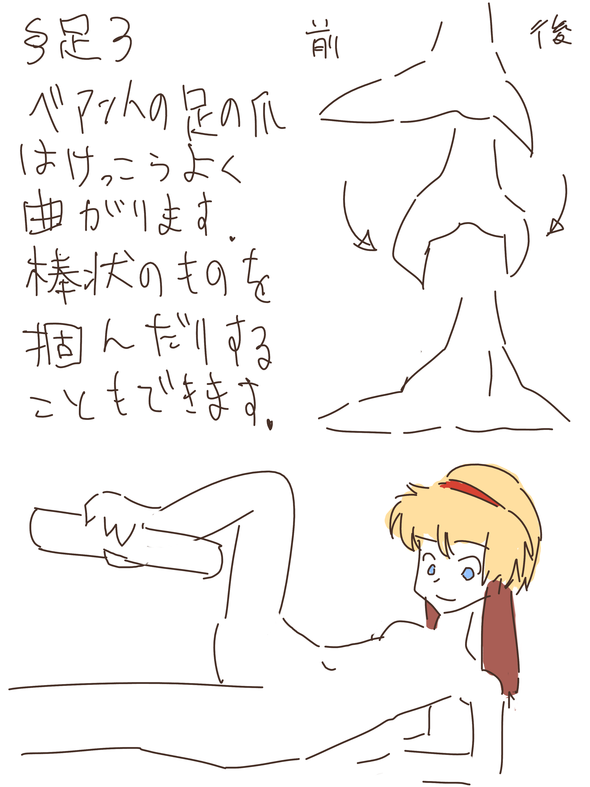
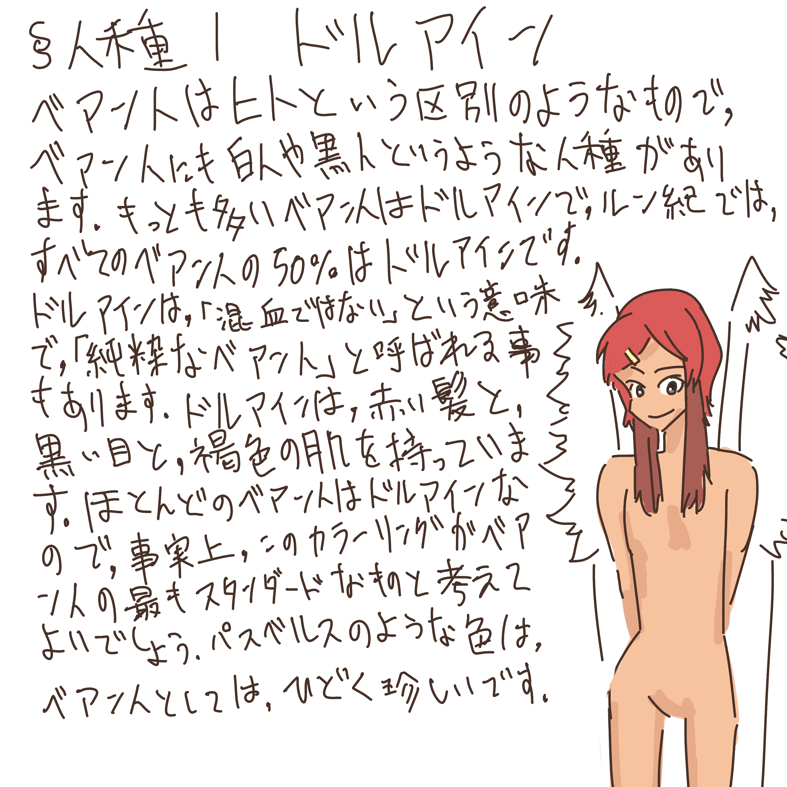
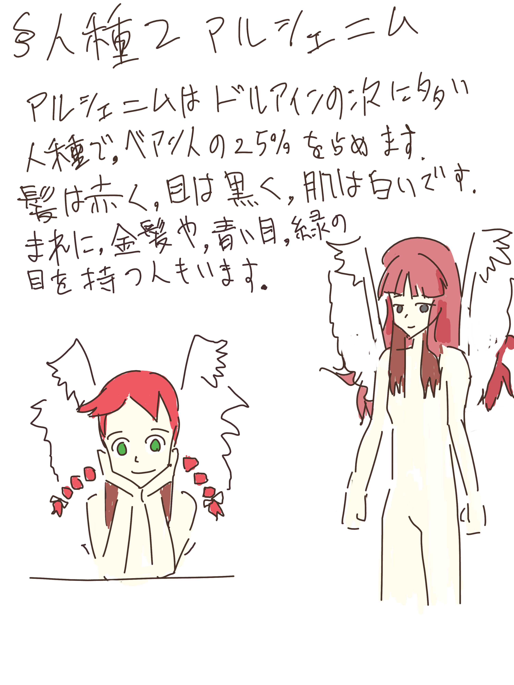
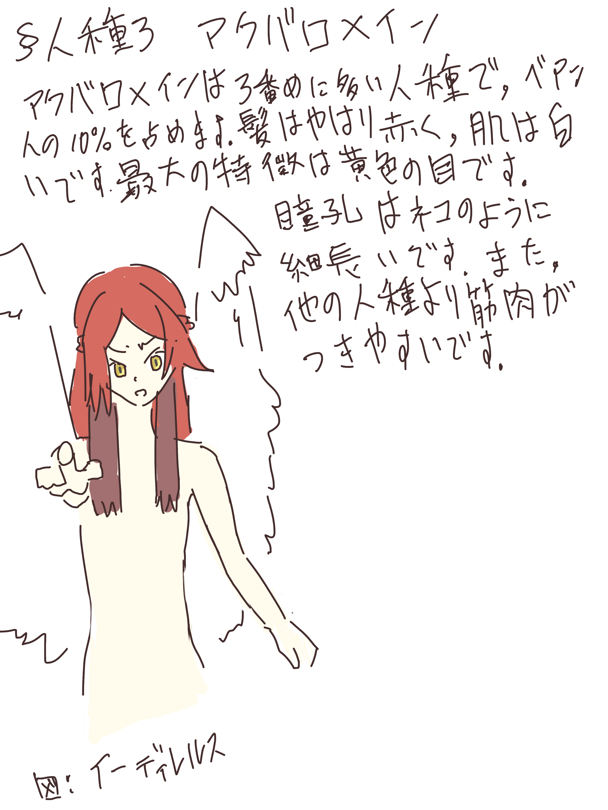

ベアン人
================================================================================

ベアン人は、ベアン紀〜ルン紀に存在する生物である。

体の構造は、基本的に人間に近い。つまり、頭部があって、
胴体があって、手があって、足があるということである。
目は顔の前方に2つついている。鼻もやはり顔の前方についているし、
口も顔の前方についている。

ベアン人という呼称はルン語であり、ベアン語ではベシム人という。
それぞれの言語では以下のように呼ぶ。

:ベアン語: ベシム(Besim)、ベ・イェリ(Be jery)
:アルト語: ベアナイシェ(Beanish)
:ルン語: ベアン(Bean)、蛇民(へびたみ)
:アクトン語: ベストリム

また、ベアン語では、バ・イェリ(勇気の翼)に対してベ・イェリ(賢き翼)という
呼び名もある。ただし、バ・イェリは鷲や鷹を指す言葉なので、
この呼び名を差別的だと感じる人もいる。

生態
--------------------------------------------------------------------------------

- **成長速度** ベアン人の成長は早く、1歳にならずとも言葉を話せるようになる。
- **短命** ベアン人は、パストアウレインを除いてかなり短命。
- **体重** 体重は重くても20kgほどしかない。
- **筋力** 筋力はとても弱い
- **骨** 骨は薄く、折れやすい。力を込めて殴ると骨にひびが入る
- **足** 足のつめはとても大きくするどい。
  また足の皮膚は硬化していて、感覚は鈍く、
  痛みや冷たさを感じない。
  そのため、靴をはく習慣がない。

翼
@@@@@@@@@@@@@@@@@@@@@@@@@@@@@@@@@@@@@@@@@@@@@@@@@@@@@@@@@@@@@@@@@@@@@@@@@@@@@@@@

ベアン人には腰を根元にして脇から二の腕をつたいひじにかけて翼が生えている。
翼開長は身長の3倍ほどにまでなる。
ただしこの翼は名残としてのものであり、
実際には体重が重すぎて飛ぶ事はできない。

換羽と黒翼化
@@@@@@@@@@@@@@@@@@@@@@@@@@@@@@@@@@@@@@@@@@@@@@@@@@@@@@@@@@@@@@@@@@@@@@@@@@@@@@@@

ベアン人の男性は年に1度、秋期にすべての羽が抜け落ちて生え変わる。
女性は年に2度、月経のあとに生え変わる。女性の場合、
春期と秋期に2度生え変わるわけだが、春期に生えた羽を夏羽、秋期に生えた羽を冬羽という。

生え変わる時、精神的におだやかであれば、白い翼が生えてきて、
強いストレスに晒されていれば、黒い羽が生えてくる。

それ以外にも、事故などで羽が抜け落ちてしまった場合、代わりの羽が生えてくる。

また、強いストレスにおかれていると、ベアン人の翼はどんどん抜け落ちてしまう。
1日や2日なら、ストレスを感じていても問題ないが、1週間ほど
ストレスを感じ続けていると、羽がぜんぶ抜け落ちて、代わりに黒い翼が生えてくる。
この現象を **黒翼化** という 

耳
@@@@@@@@@@@@@@@@@@@@@@@@@@@@@@@@@@@@@@@@@@@@@@@@@@@@@@@@@@@@@@@@@@@@@@@@@@@@@@@@

耳は大きく、わさわさと焦げ茶の毛が生えている。
この耳は自由に動かせる。
ちょっと重いため、ふだんは垂れ下げているが、怒ると耳を持ち上げたり、
持ち上げて耳を凝らしたりする。

聴力はとてもよくて、かなり離れた音でも聞ける

月経
@@@@@@@@@@@@@@@@@@@@@@@@@@@@@@@@@@@@@@@@@@@@@@@@@@@@@@@@@@@@@@@@@@@@@@@@@@@@@@@@

ベアン人の女性の月経は、1年に2度である。
時期は個人差が大きいが、おおむね春期と秋期に1度ずつである。
初潮は3歳から5歳の間に訪れる。6歳になっても初潮が来ない場合、原発性無月経かもしれない。

生殖
@@@@@@@@@@@@@@@@@@@@@@@@@@@@@@@@@@@@@@@@@@@@@@@@@@@@@@@@@@@@@@@@@@@@@@@@@@@@@@@@

ベアン人はちょっと不思議な卵胎生である。

受精後、91日と6時間(2190時間)かけて卵を形成する。
また、同時に胎盤やへその緒も作られ、130日めくらいに完成する。

ベアン人の卵は、形成後しばらく子宮内で留まり、胎児は卵から栄養をもらって
成長する。形成された卵は完全に独立していて、体外に出ても成長できる。
この(妊娠3ヶ月めの)とき、ベアン人の女性は自分の意思で卵を排出する事もできるが、しないこともできる。

もし排出された場合、胎児はそのまま卵内で成長し、排出後平均42日後に
殻を破って生まれる。

もしずっと排出されなかった場合、卵の形成のあと、40日めくらい
(つまり妊娠4ヶ月め)に胎盤が完成する。
そのあと、卵殻は自然に溶けはじめる。25時間ほどで卵殻は完全に溶けてなくなる。
それと同時にへその緒が胎児と胎盤を結び、胎生に移行する。

胎生に移行してからは、胎児は母親から栄養をもらい、6ヶ月かけて子宮内で
成長する。
合計10ヶ月ほどで赤ちゃんは生まれる。

このように、ベアン人は妊娠3ヶ月目に卵を排出する形と
10ヶ月間胎内で育てる形の2種類の方法で子供を生む事ができる。
ただし、一般に卵を排出すると未熟な状態で生まれてしまい
死亡しやすいので、ふつうは排出しない。

消化器官や臓器など
@@@@@@@@@@@@@@@@@@@@@@@@@@@@@@@@@@@@@@@@@@@@@@@@@@@@@@@@@@@@@@@@@@@@@@@@@@@@@@@@

ベアン人の消化器官はルン人と比べて貧弱で、
うまく消化できない食べ物がいろいろとある。
特に野菜や果物の類は、食べるとすぐに下痢を起こしてしまう。
食べた食べ物はまずそのうに送られ、一時的に蓄える。
そのあとそのうからすこしずつさのうに送られて、
咀嚼してから胃に送られる(ただし、このさのうは退化しており、ほとんど役割をはたさない)。

また、各種臓器もルン人に比べると弱い。
たとえば、ベアン人は肝臓がとても弱く、お酒を飲むとおちょこくらいの量でも顔が真っ赤になるほど酔ってしまう

発声器官
@@@@@@@@@@@@@@@@@@@@@@@@@@@@@@@@@@@@@@@@@@@@@@@@@@@@@@@@@@@@@@@@@@@@@@@@@@@@@@@@

ベアン人は声帯を持たず、鳴管という器官で発声する。
鳴管は器官の奥にあるので、ベアン人はとても大きい声が出せる。
またこの器官はかなり発達していて、
しっかりと練習すれば、自在に、どんな声でも出せるようになる。
ベアン人の声はルン人にとってたいへん聞き心地のよいもので、
「音色のよう」と比喩される。

喉仏に相当するものはなく、男性も女性も同様に声が高い。

呼吸器官
@@@@@@@@@@@@@@@@@@@@@@@@@@@@@@@@@@@@@@@@@@@@@@@@@@@@@@@@@@@@@@@@@@@@@@@@@@@@@@@@

横隔膜はなく、気嚢で呼吸をする。
この器官はほ乳類よりたいへんすぐれていて、
ベアン人はほとんど息継ぎなしで喋り続けたりできる。

目
@@@@@@@@@@@@@@@@@@@@@@@@@@@@@@@@@@@@@@@@@@@@@@@@@@@@@@@@@@@@@@@@@@@@@@@@@@@@@@@@

目は人間とよく似ているが、人間よりたいへんよく、どんな先のものでも見える。

ベアン人の目の色素は、ストレスを感じると失われていき、
だんだん血の色が透けて赤くなってしまう。

分類
--------------------------------------------------------------------------------

ベアン人の中にも、白人や黒人のような微妙な差を持つ人種がある。

* ドルアイン(純粋なベアン人)
* アルシェニム
* アクバロメイン
* パストアウレイン

(TODO)

耳1
--------------------------------------------------------------------------------

.. figure:: 3.png

耳2
--------------------------------------------------------------------------------

.. figure:: 4.png

耳3
--------------------------------------------------------------------------------

.. figure:: 5.png

耳4
--------------------------------------------------------------------------------

.. figure:: 6.png

翼1
--------------------------------------------------------------------------------

.. figure:: 7.png

翼2
--------------------------------------------------------------------------------

.. figure:: 8.png

翼3
--------------------------------------------------------------------------------

.. figure:: 9.png

翼4
--------------------------------------------------------------------------------

.. figure:: 10.png

翼5
--------------------------------------------------------------------------------

.. figure:: 11.png

足1
--------------------------------------------------------------------------------

.. figure:: 12.png

足2
--------------------------------------------------------------------------------

.. figure:: 13.png

足3
--------------------------------------------------------------------------------

人種1
--------------------------------------------------------------------------------

人種2
--------------------------------------------------------------------------------

人種3
--------------------------------------------------------------------------------

