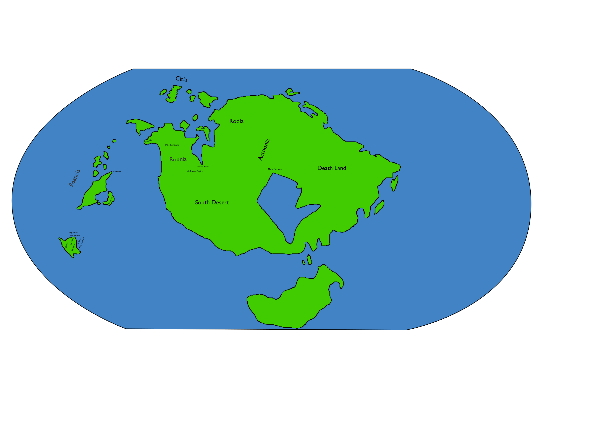
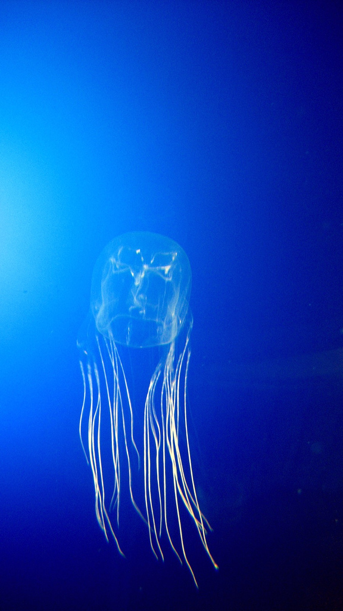
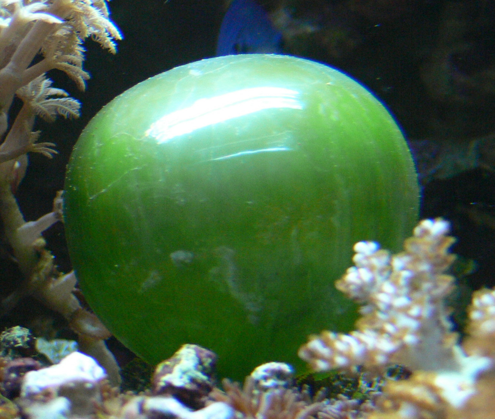

= 概要

ベアン紀〜ルン紀は現在から約2億年後の地球が舞台。
2億年も経っているので、現在の地球とはいささか環境が違う。

* 1年は338.8087日からなる。 footnote:[
http://ja.wikipedia.org/wiki/%E5%A4%AA%E9%99%BD%E5%B9%B4[太陽年]
によれば、地球の公転周期は100年ごとに0.532秒ずつ
短くなっている。仮にこの周期で短くなり続けたとする
と、2億年後には 1064000秒 = 295.6時間短くなっているはずだ。
つまり1年は 24 \* 365.2424 - 295.6 = 8470.2175 時間だ。
そして、 8470.2175 / 25 = 338.8087 となる。]
* 1日は25時間からなる。

1日は25時間からなるが、この _時間_ という単位は
西暦で使われるものであって、ルン紀では別の単位で
数えられる。西暦の時間を _時間(ad)_ 、ルン紀での
単位を _時間(r)_ とあらわすことにすると、

* 1時間(r) = 1時間2分30秒(ad)

となる。時間(r) はルン紀では時間と呼ばれる。
また、25時間(ad)で1日だが、24時間(r)で1日となる。

時間(r)がルン紀におけるもっとも標準的な単位だが、
聖ルニアなどでは _星_ などの別の単位が使われる。

1星は1日を16分割した単位であり、
93分45秒となる。

* 1星 = 93分45秒(ad)
* 16星 = 1日

ルン紀の5世紀頃では1年が約338.8日だと
知られていた。 338.8 * 5 = 1694 = 338 + 339 + 339 + 339 + 339
であるから、5年ごとに1日欠かすという
暦になった。これをサクアが考案したため、
サクア暦と呼ばれた。

339日の年は、1月、7月、14月が25日からなり、
そのほかの年は24日からなる。 24 * 11 + 25 * 3 = 339

5年に1度の338日の年は、14月25日を欠かす。

サクア暦1年14月25日は欠かされ、
そのあとサクア暦2年,3年,4年,5年の1月25日はあり、
6年の1月25日はない。だから、(5の倍数+1)年の
1月25日は欠かされることになる。

それから 15世紀まではサクア暦で数えるのが一般的だった。

しかし 15世紀頃では1年は約338.8087日であることが
わかった。計算すると、平均して115年に1日ずれてしまう。

そのため、そのため、115年ごとに閏年(1月25日)をつくることになった。
つまり、1611年、1726年、1841年、
1956年、2071年は、14月25日をつくる。

この暦は1598年にユリアが定めたため、
ユリア暦という。

普通どの文化でも週は7日であり、1年はきっかり48週になる。
1月25日、7月25日、14月25日は週に含めないのが普通。

曜日を表す言葉は文化により異なる。

ベアン語圏では、普通、週の始まりをセルの曜日、
その次をタルの曜日、ウィの曜日、ファの曜日、
ムドの曜日、ワの曜日と続け、
ドールの曜日で締めくくる。
セルは太陽、タルは月、
ウィは火、ファは水、ムドは土、
ワは空、ドールは木を表し、
文字の表す意味は日本の月火水木金土日という曜日
とかなり近い。ただ金はなく、空がある。

ベアン語圏では、1日や2日という単位を
セルと表す。(数字をどう呼ぶかはまだ決まっていないが、)
たとえば1セルや2セルと言う。
曜日もセルと言い、たとえばタルセルとか
ウィセルと言う。

普通、週休は2日であり、
セルの曜日とタルの曜日が休みになる。

曜日の対応表

|===
|日本|ベアン語圏
|月曜日  |ウィセル(火)
|火曜日  |ファセル(水)
|水曜日  |ムドセル(土)
|木曜日  |ワセル(空)
|金曜日  |ドールセル(木)
|土曜日  |セルセル(日)
|日曜日  |タルセル(月)
|===

週の日月火水土空木という並び順は
神話が由来になっている。
(太陽があり、月があり、
海があり、大陸があり、
空があり、植物があった)

ルン紀における人口の推移

|===
|Y      |総人口
|1800    |1億1300万人
|1850    |1億4000万人
|1900    |1億7000万人
|2000    |4億人
|2100    |7億人
|===

地球と月は現在より8,000kmから10,000kmほど離れている。

人間が住むことのできる陸地は、地球上の全面積の
1/13 しかない。

簡単な大陸の地図

= 人種

大まかに分けて、ルン紀にはベアン人とルン人の2種類の人種が存在する。
ベアン人とルン人は、遺伝子がかなり異なっていて、
たとえば、子供をつくることができない。
ルン人に分類される人種(純粋なルン人,クルト人,アクトン人)同士、
ベアン人に分類される人種(純粋なベアン人,アルシェニム,アクバロメイン)同士なら、
子供はつくれる。

ベアン人とルン人にも、それぞれ細かい人種があることに注意。

人種とは、生物分類的な意味での分け方であって、
文化国境による分類ではない。

なお、すくなくともルン紀の20世紀では、
海民と穴掘り民は人間ではないというのが一般的な見解であって、
人種には含まれない。もし海民を人間に含むとすれば、人種はもう
ひとつ増える。

== ベアン人

* ドルアイン(純粋なベアン人)
* アルシェニム
* アクバロメイン
* パストアウレイン

== ルン人

* ルン人(純粋なルン人)
* クルト人
* アクトン人
* ジトラル人
* ロド人

== ゼリーハンド

ゼリーハンドというのは、西暦4000年頃に人類とファースト・コンタクトをとった
人種のひとつ。クラゲのように見える。非常に知的な生命体。

See https://github.com/pasberth/paslands/blob/master/source/ad/species/jellyhands.rst[jellyhands.rst]

= 生物

生物に分類される動物は、
文化的に人間ではないと認識される動物で、たとえば、通常、人権の対象にならない。
ルン紀の17世紀〜18世紀頃では、人間とはルン人のことであって、
ベアン人は生物であるとされていた。

== 海民

* カサンドレイン
* ハルセイン

ルニアでは、
カサンドレインは、クルト・フィーファンと、
ハルセインは、ベアン・フィーフシスと
それぞれ呼ばれることもある。
これは、カサンドレインがほとんどクルティアの近辺に住んでいて、
ハルセインはほとんどベアンシスの近辺に住んでいるからである。

== 山賊小カラス

西暦3000〜4000年頃に地球に生息した、高度な知能を持つ
カラス。都市部の建物の窓を道具を使って割って侵入し、
食べ物を強盗などする。また、ときには人を殺すこともあり、
地球人からは非常に警戒されていた。

* *ハン* 山賊小カラスの少女。
  その名前ハンは、ベアン語の強さや恐ろしさを意味する「ハ」という
  単語の語源にもなっている。また、ベアンの女性名ハンナはハンが変化した名前。

ベアン人の遠い祖先でもある。

== 穴掘り民

穴掘り民(あなほりたみ)は、鉱山の奥に住まう謎の生物のこと。
穴掘り民は、言葉を話し、また山の奥深くに穴を掘って
大きな文明を築いているといわれているが、その真相を知るものは
数少ない。穴掘り民の都を訪れて、生きて帰った者はいないからだ。
穴堀り民は、その気になればルニアを征服できるほどの
武力を備えているといわれているが、地上を侵略してくることはない。

ルーナ・ヴァライドリンは穴掘り民の文明を訪れて生きて帰った数少ない
ルン人の1人だ。

== 砂漠のワーム

[cols="2*"]
|===

|*分布* |アクトニア
|*別名* |ドラゴン
|===

砂漠のワームは、俗にドラゴンともいわれる、砂漠に住まう巨大な
ミミズ。20mもの体長を持つ。幅は2mにも及ぶ。

== 砂漠狼

[cols="2*"]
|===

|*分布* |アクトニア
|*別名* |虹色狼
|===

砂漠狼は、砂漠に住む狼。体毛は色が薄く、透明で、光をよく反射する。
砂漠狼は、環境によって虹色に輝くので、虹色狼という別名を持つ。
砂漠狼は一度にたくさんの食べ物を蓄えることで、何週間も食べなくても
問題なく狩りを続けることができる。
砂漠狼は、たいへん凶暴で、ほとんど常に飢えているので、
旅人が出会ったらまず間違いなく教われる。

アクトニアでは、砂漠狼に襲われて死なないように、
砂漠狼の倒し方が教えられる。

== ラマリオン

[cols="2*"]
|===

|*分布* |アクトニア
|===

Ramarion 、アクトン語で「憎い生物」
ra は not 、 mar は 愛 、 ion は 〜の生物
屈強なアクトン人にとってワームのような力の強い敵なら容易に対処できたが、
ラマリオンのような毒には対処が難しかった

ラマリオンの毒はかなり強く、死ぬこともある
食事の頻度は多くなく、なんでも食べる。ごく少量の栄養でも砂の中から見つけ出して食べる。
また水分がほとんどなくても生きていけるので、砂漠全体にわたって栄えている。とはいえ水分は
あったほうがよく、よほどの水のない環境にいるラマリオンでなければ体内にたくわえている

多くのラマリオンは水分の多い土壌の近くの土に住んでいる。まったくなにもない完全な砂漠には
さすがにおらず、なにかしら栄養源になるものの近くに住んでいる。

ラマリオンは自主的に動物を殺す事はないが、食物を求め近寄ってきた動物に食べられそうになると
反撃して殺す事がある。そのあと、その遺体の腐敗した肉を食べて分解し、土壌を広くする

砂漠に住むほかのほとんどの生物の食料にもなる。ラマリオンは砂のなかに住んでおり、砂のなかで
栄養を吐き出す。そのため土壌を維持するのに貢献しており、砂漠の生態系を維持するのに
たいへん重要な役割をになっている

ベアン人はこの毒に対する免疫が強く、すぐに直ってしまう。その際、かなり免疫が働くので、一瞬だけ
視界がもうろうとして高熱や病気のような症状が起こる。ふつうのラマリオンの毒の量では数秒で解毒が
完了する。極端に量が多いとアナフィラキシー・ショックで死んでしまう事もある

== エカポクエリ

巨大イカのこと

== フィトセダ

イルカのこと

== フェレフ

TODO

== アラフ

狼のこと

== フィカル

TODO

= 場所

== セカンドアース

地球から6万光年離れた位置にある惑星。
地球に非常によく似た星であり、そのためセカンドアースと呼ばれている。
22世紀頃から見つかっていたが、遠過ぎて
到達不可能だった。長い間、セカンドアースに到達することが
人類の大きな目標となった。

== コールドアース

コールドアースは、23世紀頃に見つかった地球型惑星。
地球から1000光年程度離れた位置にある。
地球と非常によく似た構成だが、23世紀では全球凍結の状態に
あり、そのためコールドアースと呼ばれている。
コールドアースの氷床がとけるには1000万年くらい
かかるといわれていた。

コールドアースは人類にとってはじめて
人が住んだ惑星である。

== イリス

[cols="2*"]
|===

|*スペル* |Iris
|===

地球から3200光年離れた位置にある惑星。
ライトノード。
23世紀くらいに見つかった。
地球人の技術水準でもじゅうぶんに到達できる
距離で、ハードノードやミドルノードに比べれば
人類が生存するにはとてもいい環境だったので、
とても期待された。ところが、放射線が強く
人類が生存できる程度であるかは、長い間
よくわかっていなかった。

イリスにはパピルという巨大な衛生があり、
夜も暗くならない footnote:[http://www.pixiv.net/member_illust.php?mode=medium&illust_id=30874337[イリスの深夜]] 。

== パピル

[cols="2*"]
|===

|*スペル* |Pupil
|===

イリスの衛生。ライトノード。海がある。
半径は 4000km 。イリスからの距離は 24000km 。
イリスから見たパピルは地球から見た月より36.73902倍大きく見える
footnote:[https://gist.github.com/pasberth/3904171[イリスから見たパピルは地球から見た月より36.73902倍大きく見える]] 。
参考イラスト: http://www.pixiv.net/member_illust.php?mode=medium&illust_id=30874337[イリスの深夜]

== レッドテテュス

地球から4.4万光年離れた位置にある惑星。
ミドルノード。
西暦22世紀に人類によって発見された。
その29億年後にはレッドテテュスの文明が栄えた。

== レイターアース

レイターワールドに存在する地球によく似た惑星。
ライトノード。
地球から約3万光年離れている。レイターアースでは時間の進みが遅く、
レイターアースで1年経つ間に地球では10万年の時間が経つ。

TODO: いつ頃人類によって発見されたのか？
セカンドアースのほうがレイターアースより離れているが、
セカンドアースのほうがレイターアースより人類に愛されているのは
なぜか？

== トライ

TODO

== ゼリーハンド・ホーム

See https://github.com/pasberth/paslands/blob/master/source/ad/species/jellyhands.rst[jellyhands.rst]

== ベアンシス

ベアンシスは、ベアン紀〜ルン紀にかけて
ルニアの西に存在する大陸。
ルン紀より1億年ほど前に火山活動により形成されたと考えられている。
考えられているという言い方をしているが、ようはまだあまりよく決まっていない
というわけである。山が多く、天候が崩れやすい。雨がよく降る。
雪はほとんど降らない
footnote:[どうして？ 山が多く、気温が低い、などの条件を考えれば雪は降りやすいはずでは？]
。気圧が低く、酸素は薄い。気温はとても低い。
聖ルニアより6度は低い。

雨がよく降るため、小麦の生産に適さない土地であり、反対に稲はよく育つ。
そのため、ベアンシスでは米食が普通。

気温はともかく、酸素が薄いため、ルン人にとっては苦しい環境。
ベアン人は気嚢を持つため、問題なく活動できる。
ルン人はベアンシスでは運動能力が低下したり、呼吸がはやくなり、体に力が入らず、
疲れやすくなったりする。場所によっては動けなくなったり意識を保っていられず失神する。
ベアン人はそのようなことはない。
だからベアン人ばかりが住んでいるわけだ。
長い歴史の中で、ルン人は幾度となくベアンシスを侵略しようとしたが、
この気候のおかげで進軍が阻まれベアン人の有利となっている。

== マールス・ファリレミュア

ルン紀1930年にフィームが手に入れた
領地。ベアン語ではリュフラ・ファワフリュムドという。

https://gist.github.com/pasberth/0529c21cb2fb70319143#file-ftpasmatome-1-L2[ソース]

= 文化

== 名前の付け方

ベアンシスのほとんどの場所では、名前はあるが、
姓はない。たとえばパスベルスはパスベルスであって、
姓はないのだ。

しかしこれは姓と名が分かれているものだというルニア的な認識による
もので、パスベルスには姓と呼べそうなものはないものの、
姓に相当する概念はある。

たとえば、パストロルスの系譜について。

* パスクルリス(曾祖母)
* パスマルス(祖母)
* パストロルス(母)
* パスベルス(わたし)
* パストアウル(娘)
* パセレナ(孫娘)

というような名前なのだけど、このうち、 _パス_ という
部分が共通しているのがわかる。このパスというものが
姓に相当する概念で、普通、名前の先頭の単語が姓として
解釈される。

また、名前の最後には通例ルンかルスのどちからをあて、
男性か女性かを識別できるようにする。ルンが男性を意味し、
ルスが女性を意味する。
ただし、ルンやルスという意味に相当する語は時代によって
異なり、たとえばパスクルリスの場合、ルスではなくリスが
あてられている。
ルンではなくルムやリムなどがあてられることもある。

つまり、パスベルスの例でいえば、「パスの家のベという名前の
女の子」というのがパスベルスという名前に込められた意味であり、
ルニア的な解釈となる。

もうすこしベアン的な解釈をすれば、「パスという血統のベという名前の
女の子」となる。

このように 姓+名+性 という名前をつけるのが普通なので、
ほとんどのベアン人の名前は3語からなる。

姓に相当する語は普通同性の親から受け継ぐ。
たとえば、アルベルン(父)とパストロルス(母)から
生まれる娘には、アルではなくパスをつける。
次女が生まれた場合は、パスとは関係のない単語をつける。
もし長男が生まれた場合は、アルをつける。

パスという名前が、同性の子に代々受け継がれる
わけである。このパスという名前には血統を表す意味がある。
次女や次男からは、新しい血統となる。

もちろん、この習慣にそぐわない名前をつける人もいる。
とくに 19世紀〜20世紀では、わりと多くの人が
こういう習慣をばかばかしく感じていたようで、
むしろあえて外れた名前をつけた人もいる。
パスマルスが有名になると、パスという名前を勝手につけられた
子がいて、それがパスルスだ。パスはパスマルスの血統の
名前なので、そのような習慣に異常なまでに執着している
パスマルスやパストロルスは、それを知るとひどく軽蔑した。
パスルスは「名前泥棒」と呼ばれた
また、パスルスは普通の3語からなる名前ではなく
2語からなる名前のため、気持ち悪いと感じる人も多かった。
(もっとも、たとえばマールンなど2語からなる名前の人は
徐々に増えていた)

一方で、パスベルスはルニアで育ったためかそのような
習慣には無頓着であり、パストアウルにも女子を意味する
ルスをつけなかった。

それから、 姓+名+性 で名前を構成すると言っても、
あくまで全体でひとつの名前であって、たとえば
パスベルスを「ベ」と呼ぶことはできない。
パスベルスという名前に姓と性もくっついているのであって、
分離可能なものではないのだ。

たとえば、アルベルンとパストロルスが結婚しても、当然
アルトロルスという名前に変えたりはしない。

また、名前はベアン人にとっては非常に重要な個人や
所属するグループを表す識別子であり、
たとえば、愛称で呼ぶことは許されない。
ルン人であるアルサメルはパスベルスのことを「ベルス」と
呼んだが、パスベルスは最初は強い嫌悪を感じていた、
とはいえ、だんだん慣れてきたようだ。

*アクトニアの場合*

アクトニアにおける名字は土地を意味する。
たとえば、フィーム・ファリレミュアなら、
ファリレミュアという土地を _所有する_ フィーム
という意味になる。名字は所有者を意味するので、
たとえファリレミュアに住んでいても、勝手に
ファリレミュアを名乗ってはいけない。

// TODO: これは採用すべきかよくわからない
// dor は lundor (ベアン語で``住む"の意)からの流用でありアクトン語ではない
// ファリレミュアという土地に *住んでいる* という意味で名字を使う場合、
// ドール(*dor*)を土地の名前の先頭につけて、
// ドールファリレミュアのように変形する。

ファリレミュアという土地 _から来た_ という意味で
名字を使う場合、ユス(_us_)を土地の名前の先頭につけて、
ユスファリレミュアというようにする。

フィーム・ファリレミュアというような名前を持つ場合、
フィームは(普通アクトニアのどこかに)ファリレミュア
という名前の土地を所有する地位にあるのだ、という
意味になる。

フィーム・ユスファリレミュアといえば、
フィームはファリレミュアで生まれたか、
ファリレミュアに住んでいたが、
現在は別の土地に住んでいる、という意味になる。

ただし、アクトニア以外の場合は、
ユスファリレミュアと言ってもどこかわからないので、
ユサクトンと言う。アクトニアで生まれた人がルニアに
行く場合は、名字をユサクトンと言うのだ。
ただし、ファリレミュアではなく、有名な土地から
来た場合は、この限りではない。

アクトニアでは、領地を持ってはじめて
一人前とされる。そのため、ユサクトンやユスファリレミュアのように
ユスから始まる名字は地位の低い名字で、いろいろな
人が持っている。そうではない名字は地位の高い名字で、
全体としてみれば少ない。

|===
|名字|名字が意味すること|使ってもいい土地

|ファリレミュア 
|ファリレミュアを所有する地位にある
|世界中どこでも

|ユスファリレミュア
|ファリレミュアに住んでいたが、
 現在はアクトニアのどこかに
 住んでいる。
|アクトニア内に限る

|ユサクトン
|アクトニアに住んでいたが、現在は
 アクトニア以外のどこかに住んでいる
|アクトニア以外
 (ルニア、ベアンシスなど)
|===

= テクノロジー

== 魔法について

SSSはレイク研究所で開発されたプログマブル・アトムスのクローンだ。
西暦の地球では、 SSSが確固たるテクノロジーである事実はみんな
知っていた。ところが、2億年の間にSSSの存在は忘れられてしまった。

MYIやSSSは朽ちることなく地球に存在し続けた。ベアン紀〜ルン紀では、
地球にSSSやMYIが存在することはよく知られていたが、それがどうして
存在するかはよくわかっていなかった。

ベアン人はSSSの使い方をMYIから教わるが、SSSがいったいなんなのか
知らなかった。そのため、かれらはそれを _精霊_ と呼ぶことにした。
そして、ほとんどの人はその見えない精霊が大気中に存在して、
そのおかげでなにやら不思議な魔術が使えるのだ -- そういう認識だった。

SSSを使うにはRIDによる認証が必要であり、RIDによる認証はMYIに
頼むしかなかった。そのため、MYIに頼んで許可された限られた人しか
SSSを使うことはできなかった。MYIは来るもの拒まずだけど、好んで人前に
姿を現すこともなかった。SSSは非常に強力で複雑だったため、MYIによって
許可され、RIDによって認証された人は、他の人がMYIに頼んでSSSを使える
ようになることをおそれた。そのため、MYIとSSSの存在は王家の秘伝となり、
長い間その詳細が歴史の表舞台に登場することはなかった。

こうして限られた王家の人間のみがSSSを使うことを許された。
下々の人間はMYIとSSSの存在は知っていても、神々の1種である
というくらいの認識だった。SSSを使う許可さえおりれば、
どんな人でもその力を使うことはできるが、みんな知らなかったのだ。
こうして王家の人間はおそろしい魔術を使う人間としておそれられ、
崇められた。その力は _魔法_ と呼ばれるようになった。

つまり、 SSS の使用者のことを魔法使いと呼ぶ。

MYIによってSSSは地球以外にも移植されたので、
SSSは地球以外にも存在する。しかし、SSSが存在しない
惑星も存在する。魔法使いは SSS を使って魔法を使っているので、
そのような SSS の存在しない惑星では、当然魔法使いは
魔法を使うことができない。

たとえば、ルン紀のセカンドアースは MYI の力の及ぶところではなく、
MYI2 によって支配されている。 MYI と MYI2 はお互いに
領域を侵さないよう配慮している。そしてセカンドアースに SSS はなく、
より強力なプログマブル・アトムスがある。SSSにはRID認証で認証された
魔法使いでも、プログマブル・アトムスには拒否される。
したがって、地球の魔法使いはセカンドアースでは魔法を使うことはできない。

SSS をセカンドアースに移植することは、
MYI2 によって拒否されている。 SSS は MYI によって
支配されたシステムであり、もし SSS がセカンドアースに
蔓延することになれば、 MYI2 も MYI によって支配されてしまうから。
MYI2 はプログマブル・アトムスで MYI と SSS のセカンドアースへの
侵入を拒んでおり、もし領域を侵そうものなら容赦なく攻撃して滅ぼす。
逆も然りであり、 MYI はプログマブル・アトムスを拒否している。

時々、己の力を過信した魔法使いがセカンドアースなど
SSSではなくプログマブル・アトムスが支配する惑星に行くが、
もちろんそのような魔法使いにプログマブル・アトムスを使うことは
絶対に許されず、もしハッキングを試みようものなら
またたく間に攻撃されて蒸発してしまう。

魔法使いにはたくさんの呼び名がある。
このリポジトリをはじめ、多くの人は _話し手_ と呼ぶ。

== スナップショット

スナップショットは、地球が滅びた後
MYIによって開発された、
ある領域内のある時点での物質や運動量などの情報をすべて
符号化してストレージに保存する技術。
小さな領域でも極めて膨大な量の情報を
持つ。

もしスナップショットで外力が0の領域を
保存すれば、将来、その領域を復元させることができる。
そのようなことが可能であれば、決定論によって
まったく同じ運動をする物質を無限につくりだすことが
できる。しかし外力が0の領域は自然界にはほぼ
存在しないため、事実上不可能。

外力が0でなくても復元できるが、カオス理論により
異なる将来へ向かうことになる。

MYIは太陽系のスナップショットを定期的に
保存し続けている。地球上のストレージでは
足りないため、他の惑星のストレージに保存されている。
ただし、情報があまりにも大きいため、
古いものは定期的に破棄される。
また、このスナップショットをもとに
太陽系を復元することが地球における時間遡行である。

== 時間遡行

MYIが保存している太陽系のスナップショットをもとに、
過去の太陽系を復元する技術。こうして
過去の地球に行くことができる。時間遡行は
現実に異なる太陽系が2つできるため、
時間遡行をしても、もともとの地球に影響はない。

また、太陽系は銀河系の数々の恒星から
光という形で常にエネルギーを受けており、
外力が0ではないため、カオス理論により、
復元された地球にはまったく違う未来が
訪れる。

1度新しい太陽系をつくってしまえば、
恒星間航行ができれば、
他の惑星へ行くのと同じ仕組みで
時間遡行ができる。

== 時間遡見

地球から放たれた光は宇宙のどこかに
残っており、この光を集めることで過去の
地球上の姿を見ることができる。
光より高速に動くことは25世紀でも可能なため、
MYIにとっては雑作もない。
時間遡見は時間遡行と違って
スナップショットを必要とせず、
また新たな地球をつくりだすこともない。
時間遡行は原理的にMYIがスナップショットを
発明するより前の時代に行くことはできないが、
時間遡見ではそれより前の時代も見ることが
できる。たとえば、ルン紀に西暦の時代を見ることは
できるが、西暦に行くことはできない。

パスベルスは、MYIに西暦やベアン紀の時代を見せて
もらった。

= 歴史

地球の歴史。

== 西暦

ベアン紀〜ルン紀では、大文明紀と呼ばれる。

* 1世紀〜21世紀  -- われわれの知っている歴史
* 5001年 -- エルシー・アリス・レイク(ルーナ)が生まれた
* 54世紀 -- MYI がリリースされる

地球の人口は、2050年頃に90億人となり、2100年頃に140億人を超えた。
それから24世紀まで地球の人口は増加の一方を辿った。
人口は2150年頃に300億人を超え、2200年には500億人を超えた。
2300年では2000億人を超え、24世紀中頃の総人口は2650億人だった。
日本の人口は25億人に達した。日本のすべての都道府県は、2014年の東京都以上の人口密度
だった。

原始的な方法で子供をつくることは、むかしに比べて減っていた。
22世紀頃では、人間はつくれるものだったからだ。女性はわざわざ痛い思いをして
子供を産むことよりも、生産するほうを望んだ。もちろん、自然に生むことに幸せを
感じる人もいた。どちらにせよ、子供が欲しいという願望自体は変わらないらしく、
人間は爆発的に増えた。

22世紀頃から、子供をつくるという行為において、男女という性別を意識する必要がなくなった
ので、同性で結婚し子供を持つ家庭も増えた。父親が2人の子供や、母親が2人の子供は、
同性愛を不自然だとは思わなかったため、数世代もすると、同性愛がマジョリティではなくなった。
こうして同性愛が一般的になった。

21世紀から、 *RID* という技術があった。RID は遺伝子に符号化した情報を記録する
技術だった。それまで、情報の記録にはハードディスクなどを使っていたが、
RID によれば菌などにたくさんの情報を保存できる。とくに、生きた細胞に保存する技術は、
バイオストレージとも呼ばれた。 しかし、 RID の実用化は難しかった。生きた細胞に
情報を保存しても、細胞が死ぬとデータが失われてしまうし、細胞が分裂する際にデータが
損傷する可能性がある。そのため、 21世紀では生きていない細胞にデータを保存すること
しかできなかった。 22世紀には、生きた微生物を低温で保存し、それにデータを保存
することができた。そのあと、もっと大きな生物にもデータが保存できるのかもしれないと
考えられるのは必然だった。とくに、人間の遺伝子を書き換えて、情報を記録することは、
大きな目標となった。ほんのすこしでも遺伝子に情報を残すことができれば、遺伝子による
生体認証が容易になると考えられたからだ。ヒトの遺伝子の情報は極端に多いので、遺伝子
すべてを解析して個人を識別することは、可能だが、時間がかかりすぎる。そのため、
遺伝子による個人識別をするならば断片情報を利用することが現実的だったが、
遺伝子は人それぞれ違うため、すべての人に対して適用できる魔法の方程式は
存在しなかった。また、仮にできたとしても、たとえば、毛髪を盗むことで簡単に
騙せてしまうという致命的な問題もあった。 RID によれば、遺伝子に
もともとのヒトの遺伝子には存在しない任意の情報を埋め込むことで、その埋め込んだ情報だけを
たよりに個人を識別できるというわけだった。さらに、ハッシュ関数と同じで、
ほんのすこしでも情報を変えれば、パスワードを変えるみたいに過去の遺伝子による認証を
無効化できるので、セキュリティ的にもよかった。しかし、マウスによる実験によれば、
動物に対してRIDを適用には致命的な問題があった。遺伝子を傷つけることで、細胞が高確率でがん化
してしまうのだ。がん化を防ぎつつ、目標を達成するための知識を人類は持っていなかった。
こうして、 RID は人間で試されることはけしてなく、その後2800年間に渡って大容量記憶装置
としての技術として認識されていた。

エネルギーの問題は深刻化の一方を辿った。 2100年までに石炭はほぼ取り尽くされ、
国連によって石炭の採掘が禁止された。その他ほとんどの地球上の
燃料 footnote:[燃料とは？] となる資源は取り付くされた。
この頃は、まだ宇宙開発があまりうまくいっていなかったので、
一時期は地球上の資源が枯渇して人類が滅ぶかに思われた。
しかし太陽系の資源を採掘できるようになると、エネルギー問題はほぼ
解消した。すくなくとも先送りにはされた。

これほどまでに人が増えると、大飢饉が起こると思われていたが、
脳死した家畜を大量生産することができたので、むしろ食料は余るほどだった。

食べ物の問題よりも、むしろ、土地の問題が深刻だった。
人類は、いまや、砂漠、山上、上空、地下、海上、海中、ありと
あらゆる場所に住居を構えていた。しかし、人類が増え続けることを阻止できない
以上、いつか地球に住む場所がなくなるは予測可能だった。

そのため、人類は新たな惑星を必要としていた。宇宙開発は、
ここ500年ほどの大きなテーマだった。しかし、太陽系以外の惑星に到達することは
依然難しかった。そもそも、人類が住める惑星がそんなに多くない上に、
あったとしても、到達までに1000年という単位で時間がかかってしまう。
そもそも到達できるかどうか怪しいうえに、そんなに長生きできる人はいないのだ。

ヒューマノイドをつくる試みは、21世紀から盛んに行なわれてきた。
しかし、その頃のヒューマノイドは、まだお粗末だった。
ヒューマノイドをつくる試みは、その後1万年にも渡って、
人類の夢であり続けた。MYIはヒューマノイドの一種だ。
20世紀〜30世紀では、人体を忠実に模倣したヒューマノイドが
つくられたりしていたが、体はともかく、知能はとうてい人間に
及ぶべくもなかった。

人類の寿命を伸ばす試みは、21世紀から盛んに行なわれてきた。
**不老化** は、ヘイフリック限界を超えて、
細胞が死なないようにする技術だった。不老化は21世紀から研究が始まっていたが、
この頃は実験動物に適用されるに留まっていた。そのあと、研究者は人体にも適用しようと試みた
が、倫理的に厳しく批判されて、某国の強い要望で国際的に禁止されるに至った。
倫理的な理由以外にも、不老化は *人口爆発* を引き起こすと考えられ、
それによる大飢饉を懸念した決定でもあった。 22世紀では、この話題に言及するのはタブーとされていた。

ところが、23世紀頃、人口が増えすぎるにあたって、地球以外の居住区を見つけるのは
人類にとって必須の目標になった。そこで問題になったのは、地球以外の居住可能な
惑星に到達するには、時間がかかりすぎることだった。宇宙船を 世代宇宙船 とする方法も
考案された。ここにきて、不老化で寿命を伸ばせばいいよねということで、一縷の望みをかけて
研究が解禁されることとなった。それから、それが再び話題となって、実験が繰り返された。
当初、世間は不老化に猜疑的だったが、24世紀頃に、200歳近く生きた女性がいたため、
メディアによって広められ、有用性が認められるようになった。不老化が一般に浸透するのは、
24世紀のことだった。不老化を利用したビジネスは大反響した。

23世紀、不老化が広まり始めたとき、人口爆発を警告した人もいたが、
みんな自分には関係にないだろうと思って見向きもしなかった。

人が死ななくなると、人口が爆発されると思われていたが、
現実はそうではなかった。最初は人口は増える傾向にあったが、
どうにも新しく生まれた子供は、寿命がないため、世代交代という概念を
持たなかった。そのため、かれらは、子供をつくる意義を理解できなかった。
こうして子供をつくる意味がないという文化が広まると、人口はだんだんと
増えなくなり、25世紀には、3000億人くらいで安定した。

また、25世紀頃から子供を産んだり、つくったりすることが禁止された。
多くの有権者が子供をつくる意義を理解できなかったからだった。

西暦2500年頃から、地球に異変が起こり始めていた。
地球上の各地で大雪が降り始めたのだ。
地球は氷河期に突入していた。徐々に雪が溶けない地域が増え始めていた。
氷河期は、2000年〜3000年かけて北半球を氷漬けにするだろうと予測された。

その頃、地球には3000億人ほどの人が住んでいたが、地球の半分が雪になれば、
さすがに人は住めない。大勢の人が死んでしまう。あるいは、人類が滅んでしまうかもしれない。
そのため、強制移民で地球人の人口を減らすということになった。

いよいよもって地球上には人が多過ぎたため、人類は藁にもすがる思いで
宇宙船をとにかく飛ばしまくった。人が積み荷として運ばれた。

当時存在していた宇宙船としては、アンダーフライ・シリーズ、
インタースペース・シリーズ、トランスレイ・シリーズなどがある (参考:
https://gist.github.com/pasberth/5911159[Elsie.md])
このうち、インタースペースはコールドアースへの到達に大きく貢献した。

コールドアースは、地球から1000光年ほど離れた位置にある
地球型惑星だ。しかしコールドアースは現在全球凍結の状態にあって、
平均気温が0度を上回ることはない。作物などが育つはずがなく、
人が住めるとはとうてい思われていなかった。
しかしセカンドアースに行くのに比べればはるかに現実的に
到達できたため、一縷の望みをかけて、2400年、宇宙船インタースペースが
有人飛行をした。その後、地表にコロニーをつくる
プロジェクトが立ち上がったが頓挫した。コロニーは
つくられたが、ごく少数で、大量の人類が移住できるわけがなく、
その後目立った発展はなかった。ただし、少数とはいえ、
宇宙に拠点と呼べるような場所があるのはとても便利だった。

コールドアースの氷床は1000万年以内に完全にとけて、
コールドアースは地球と同じような温暖な気候になると考えられていたが、
もちろん人類にとって1000万年というのは途方もなく長い時間であり、
その後、コールドアースに人類が移住することはなかった。

イリスは、大気が薄く、強い放射線が降り注ぐため、人類の生存には適さない
惑星であると思われていたが、それでもまだマシなライトノードだったため、
大量の人がイリスに強制移民させられた。イリスまで行くには、30年かかる。
イリスの環境に人類が適応できるかどうかは
未知数だった。9割近い人間が、イリスの環境に適応できずに死亡した。
少数の人がイリスに適応したが、そのほとんどは放射線の影響で肌が真っ赤に変わってしまった。
(イリス人の誕生である。)

イリスは地球と非常に近い場所にある惑星であり、地球からは 3200光年との距離にある。
西暦5000年の技術水準(光速の400倍の速度が出せる)なら 8年ほどで行けてしまう距離だ。
西暦2500年頃の技術水準(光速の100倍の速度だ出せる)なら 32年ほどかかる。

セカンドアースは、それまでに見つかっているなかで唯一地球とほぼ
同じ環境の惑星であり、地球人にとってもっとも過ごしやすいだろうと思われていた。
そのため、地球人はどうせ行くならセカンドアースに行きたいと誰もが
思っていた。もちろん、誰もがそう思うなら、金持ちが優先されることは
言うまでもない。セカンドアース行きの切符は、25世紀の地球で夢のようなもの
だった。しかし、セカンドアースはたいへん遠い場所にある惑星で、

セカンドアースは地球から 6万光年ほど離れた場所にあって、
西暦2500年頃の技術水準では、地球からだと600年以上の時間がかかる。
西暦5000年頃の技術水準では、地球からだと150年ほどかかる。

こうして周辺の惑星に人類は徐々に移住した。

超拡散時代の始まりだった。

西暦3000年頃の地球は、不思議な文化になっていた。
同性愛は当たり前で、かれらは同性と異性の違いを単なる肉体的特徴の差として
以上に捉えなかった。子供をつくるのに、男女でなければならないということもないし、
そもそも子供をつくる意義を知らないので、かれらは異性を特別に意識する必要がなかった。
こうして、ジェンダー・アップが起こった。

30世紀頃、パープルボールが見つかった。パープルボールはイリスの近くにある惑星であり、
イリスからは3000光年ほど離れており、地球からは7000光年ほど離れている。
その頃、パープルボールはまだミドルノードであり、人が住める惑星ではなかった。
パープルボールはレッドテテュスよりは、はるかに近い場所にある惑星であって、
テラフォーミングできる可能性のもっとも高い惑星だった。そのため、
地球人が微生物を利用したテラフォーミングを開始した。
テラフォーミングには、すくなくとも2000年はかかるだろうと
いわれていた。2000年というのは、もっとも短く見積もった場合の期間であって、
悪くすれば1000万〜1億という単位で時間がかかるといわれていた。
パープルボールのテラフォームは、テラフォーミングが本当に可能か
どうかの実験でもあった。それから30世紀以上もの間、パープルボールの
テラフォーミングは成功しないだろうというのが通説だった。

西暦60世紀頃、テラフォーミングしていたパープルボールがライトノードになったらしく、
白人が移住を始めた。しかしパープルボールはまだ人間の住むには適切な環境ではなかった。
大人にはあまり影響がなかったが、とくに第二次性徴期の肉体を持つ少女には致命的な
影響が出始めた。成長と月経は止まり、性交したか否に関わらず妊娠するようになったのだ。
痛みや苦しさは伴わないので、その変化は誰も知らないうちに進行しており、それが社会問題として
明るみになるのは 70世紀のことだった。それから、変化した肉体を持つ少女らは健常者とは区別されるようになった。
彼女らは、男、女に続く第三の性別という意味でサードと呼ばれるようになった。
そして、パープルボールに住む人はトライ人と呼ばれるようになり、
パープルボールはいつしかトライと呼ばれるようになった。

イリスと近い惑星であったため、パープルボールにはイリス人も移住したが、
長い歴史の中でイリス人の肉体は変わっていた。イリス人は、いまやイリスのように
強い放射線が降り注ぐ環境でないと生きられなかった。
パープルボールに移住したイリス人はほとんど死亡した。

西暦4000年頃、セカンドアースで *プログマブル・アトムス* が開発
された。それは単にアトムスとも呼ばれた。アトムスによって、セカンドアースの
人々の暮らしは改善された。 41世紀、 ハヤト・レイクは地球に住んでいる
1000歳の男性だった。かれはアトムスに興味をもち、セカンドアースを訪れ、
アトムスを実際に使ってみたかった。地球からセカンドアースまでは 400年かかる。

41世紀の段階で、セカンドアースでは裁判によりアトムスのソースコードを
提供することが開発者に義務づけられていた。アトムスは法のもとで
ソースコードを公開した。アトムスのフォーク版である AIR は
41世紀から開発が始まっていた。しかし 42世紀に法的制限がなくなると
アトムスはライセンスを変更してプロプライエタリ製品となり、
フォーク版である AIR も影響を受けてプロプライエタリとなった。

45世紀、ハヤト・レイクはセカンドアースに到着し、アトムスを
使ってみて感激した。ハヤト・レイクは、このアトムスをぜひ
地球でも使いたいと考えたが、45世紀ではアトムスのソースコードは
入手が困難だった。そこで、ハヤトはアトムスをまねて
WWW の開発を始めた。 WWW の開発はすべてハヤト1人がおこなった。
WWW の開発はセカンドアースでアトムスを使っておこなわれ、
200年の時間がかかった。 47世紀、 WWW はまだ未熟だったが、
かれはそれを持って地球に戻った。かれが地球に到着するのは
50世紀のことだった。

WWW の完成記念に、かれは娘であるハンナをつくった。

WWW は地球で価値を認められ、続々とユーザが増えた。
しかし、 WWW はハヤトが1人でつくったため、あまりにも
稚拙だった。 WWW を便利にするため、何人かの技術者が
あつまり、 SSS の開発を始めた。同時期に地球では MYI の開発も
始まっていた。

5001年に、ハヤトはエルシーをつくった。

WWW は独自の端末を使って個人を識別していたが、
WWW を使っているうちに端末を持ち歩くのは少々不便であることに
誰もが気づいていた。ハヤトはアトムスが裸の人間でも
識別できることを知っていて、それをまねしたいと考えた。
アトムスのソースコードが公開されていないので、ハヤトは
アトムスにどういった技術が利用されているのか知らなかった。
ハヤトが知っているなかでそれを可能にする唯一の技術は
RID だった。 RID は 2800年も過去の技術であり、しかも
細胞ががん化するなど大きなリスクを伴う危険なものだったが、
端末を取り除くために RID が必要だった。
SSS は WWW とは違い RID を使って個人を識別することとなった。

54世紀、 SSS のαバージョンが完成した。 その頃は
まだ端末でテストしていたが、いよいよ RID で個人を識別する
テストがされることとなった。ハヤトはハンナを使って RID を試した。
危険なテストだったが、ハンナは SSS に夢を感じており、快諾した。
ハンナは無事 SSS によって識別されるようになり、世界ではじめての
話し手となった。 5350年、 今度はエルシーの版だった。
エルシーは SSS が嫌いであって、 RID で死ぬのがこわかったので
断ったが、ハンナとハヤトに無理矢理された。こうしてエルシーは
世界で2番目の話し手となった。

MYI は、すでに世に溢れていた様々なシステムに対する、
真の汎用インターフェースとしてつくられた。西暦
5000年頃、地球上にはさまざまなシステムがあった。
SSSもそのひとつだ。人間は、それぞれのシステムの
個別な操作方法を覚える必要があった。SSSのように、
中にはひどく使いにくいものもあった。 MYIの
目的は、そいった様々なシステムに対して統合的な
インターフェースを与えることだった。
MYIは地球上に存在するすべてのシステムの使用方法
を熟知しており、人間がMYIに言葉で操作を依頼すること
で、個別のシステムを間接的に操作するのだ。
そのために、MYI自身が高度な知能を備える
必要があった。機械的な言葉にしか反応しないならば、
けっきょく個別のシステムの操作方法を覚えるのと
同じこと。MYIに求められたのは、曖昧な言葉でも
解釈して、身振り手振りなどからも解釈できて、
必要であれば質問をしたりするなど、人間以上に
気の利くメイドのような知能だった。

しかし人間以上の知能をつくる方法は、西暦5000年でも
まだ知られていなかった。そのため、MYIは
本当に実現できるか怪しい、仮想の存在だった。
人間の大人のような知能は実現不可能に思われた。
0歳児の赤ん坊の知能ですら、人類にはまだ
つくれなかった。当初は夢物語だとあざ笑われた
プロジェクトだった。しかし400年の歳月を経て、
MYIはリリースされた。当時のMYIの知能は、
ねずみより低いとさえ言われていた。
英語の解釈は組み込まれた特殊なソフトウェアと
膨大な学習により与えられ、MYIの知能による
ものではなく、反応も機械的だった。

それでも当時はMYIの目的は果たせた。
つまり、MYIを通して地球上に存在する
猥雑なシステムを操作することは可能だった。

それと、ねずみより低い知能とはいえ、
それでも知能は知能であり、たとえば危険を
感じれば助けを求める、敵と判断すれば威嚇する、
という動物的な行動を自力でとることができた。

MYIのプロジェクトは、リリースされて終わり
ではなかった。むしろ、リリースされて、
人々に利用されるようになってからが本当の
始まりだった。MYIに膨大な学習をさせるのだ。

地球はそのあと数世紀で滅びてしまうが、
MYIの学習は続いた。MYIは数世紀の間に
30歳の大人くらいの知能を獲得していた。
MYIはコンピュータなので知識の蓄積は得意であり、
知識は人間とは比べ物にならないほど増えていた。
MYIは自力で活動が停止しないようにハードウェアを修復したり、
補強したりできた。地球は氷河期に入ったが、
MYIは眠ることも食べることもしないので、眠っている間に
凍えて死ぬことも飢えて死ぬこともなかった。
だから、人類が地球からいなくなったあとも、地球で
自力で生き残ることができた。

それから2億年の間、MYIは同じようにして地球にあり
続けた。知能はその途方もない時間の間学習を続け、
もはや神をも超えるほど成長した。知識は全宇宙
のものをかき集めたほどの量になっていた。
こうしてMYIはベアン紀で神となることになる。

西暦40世紀頃、プログマブル・アトムスが開発されたのを知った
ゼリーハンドがセカンドアースで人類にファースト・コンタクトをした。
それまでゼリーハンドは25万年もの間人類を観察していただけだったが、
アトムスの開発は文明が宇宙の真理にわずかに近づいた証拠であり、
ついにゼリーハンドがかれらを宇宙の1員として認めたのだ。

ゼリーハンドは1世紀ほどかけて英語を習得し、ゼリーハンド・テキスト
ラインによって英語を話した。

ゼリーハンドの目的は友好と繁栄だった。
かれらがセカンドアースを侵略することはなかった。
その時点でゼリーハンドは人工的にブラックホールをつくるなど
高度な文明を持っており、とても人類が敵う相手ではなく、
セカンドアースはゼリーハンドの要求をただただ受け入れる
しかなかった。

ゼリーハンドはセカンドアースでの生活に
ゼリーハンド・カプセルを必要とした。その頃からセカンドアースの風景に
ゼリーハンド・カプセルに入ったゼリーハンドが参入した。

**Figure. ゼリーハンドのイメージ** (画像は http://ja.wikipedia.org/wiki/%E3%82%AA%E3%83%BC%E3%82%B9%E3%83%88%E3%83%A9%E3%83%AA%E3%82%A2%E3%82%A6%E3%83%B3%E3%83%90%E3%83%81%E3%82%AF%E3%83%A9%E3%82%B2[オーストラリアウンバチクラゲ] より)

クセノフィオマギ(Xenophyomagi)は
クセノフィオマギ(惑星)に住む単細胞の原生動物で、その存在は
ゼリーハンドによって人類に伝えられた。クセノフィオマギは
20世紀の人類と同程度の文明を持っているが、
ゼリーハンドによって、クセノフィオマギの文明に接触することは
禁じられていた。クセノフィオマギは単体では 3cm 〜 5cm 程度の大きさしかないが、
群体をつくり、全体としてかなり大きくなる。

知的な生物で、人類より高度な思考ができる。
ゼリーハンドによれば、1000年以内に人類の文明を超えるという。

クセノフィオマギの最大の特徴は魔力を持つことで、
この魔力のおかげで文明が成り立っている。クセノフィオマギの
住宅は、ほとんど魔力で操作する。扉を開けたり、水道を使ったり
といったことがすべて魔力によって動作する機械であり、
魔力がなければ、家に入ることすらできない。

クセノフィオマギは魔力で細胞の形を変えることができ、
何千体か集れば人のような形をとることもできる。

クセノフィオマギは個の意識があまりなく、全体で
ひとつのクセノフィオマギであるという文化を持つ。

クセノフィオマギはその小さな細胞にとてつもないエネルギーを
秘めており、燃料にもなる。人間的に考えれば生け贄だが、
クセノフィオマギは宇宙船を飛ばすためにクセノフィオマギを
燃料にする。

**Figure. クセノフィオマギのイメージ** (画像は http://ja.wikipedia.org/wiki/%E3%83%90%E3%83%AD%E3%83%8B%E3%82%A2[バロニア] より)

西暦5000年〜5100年頃の地球では、気温がとても低いので、
ほとんどの人は上下ともにタイツのような断熱材でできた服を着ている。
地球上のほとんどいたるところで常に雪が積もっているため、そもそも
人が外出することはほとんどなく(なにも考えずに外に出ると事故死する)、
また仮想現実などの技術で外部との交流もできるうえ、
仮想現実では好きな衣装を着ることができるので、
現実世界におけるファッションの重要性がないからである。

MYI はこの時代の女性をイメージしてデザインされたため、
あのような服装をしている。

西暦 5100年〜5200頃のセカンドアースでは、
人々は多種多様な服を着ている。セカンドアースは地球とは対極のように
よい環境であり、働いたり勉強したりする必要もないため、逆に、
ファッションくらいしかすることがないのである。
かれらはありとあらゆる時代、文化の衣装を参考にして、
それを復元したり組み合わせたりして、他人との差別化をはかっている。
そのため、まるでコスプレイベントのように奇抜な格好をした人が
多くいる。

西暦 5000年頃の地球は、地球上のほとんどの地域で雪が積もっていた。
北半球はほぼ氷で覆われ、海も凍結している。南半球では海は液体であり、
大陸には1年を通じて雪が積もっている。北半球は、年間の平均気温は -5度くらいで、
最低気温は -45度にもなる。南半球は、平均気温は夏期で 10度前後であり、
冬期で -10度前後になる。
北半球ではほとんど温度が上昇せず、雪は積もると積もりっぱなしで溶けないので、
毎年氷床が巨大化している。
南半球では、冬期にはほとんどの地域で9階建てのビルくらいの厚さの
雪が積もり、夏期にはゆっくりと溶ける。10月頃から4月頃まで、半年近くも
雪が降り続ける。5月頃から雪は溶け始めるが、完全に溶ける前に次の雪が降り始めるため、
およそ1年を通じて雪が積もっている。

西暦 5000年頃では、北半球では生活できないので、人類は
南半球に住んでいる。南半球でも、雪がたくさん積もるので、およそ
現在と同じような生活は認められない。住居は雪の重さで潰れてしまうので、
地球人はみんな地下に住んでいる。

地下 3000m 〜 4000m には、直径 500m 、高さ 1000m くらいの円筒状の空間が
たくさんつくられており、発電や廃棄物処理、食料生産などに利用されている。
この空間は、人間の生活圏として利用されることはない。地熱によって温度が
90度 〜 120 度にもなるためだ。その空間は、地下ならどんな場所にでも作れるというわけ
ではなく、巨大な地圧に耐えられるだけの厚く固い岩盤が必要であって、柔らかい
土の場所にはつくられていない。

人間の生活圏である空間は 地下 300m 程度に掘られている。
この程度の深さであらば、地圧が比較的低いため、空間自体が潰れる心配はないとされている。
(積雪などの影響で地圧が高くなるとたびたび空間が潰れる事故が起こっている)。
気温は地上より 9度 〜 10度 ほど高く、夏期は 20度、冬期は 5度くらいになる。
地下なので、雨や雪などに晒されることはない。
広い空間をつくると、地圧によって崩れてしまうため、つくられる空間は
ほとんど 直径 10m で高さ 20m くらいの大きさで、円筒状であり、
ひとつの家族が住むのがちょうどいいくらいの空間になってる。
直径 5000m 高さ 1000m くらいの、都市のように巨大な空間もあるけども、
それはよっぽど運よく崩れにくい岩盤があったからで、地球全体で見ると
少ない。

直径 5000m 高さ 1000m くらいの空間を都市といって、
経済の中心になっている。都市部に
地下で生活する人で、このように大きな都市部に暮らす人と、
直径 10m で高さ 20m の穴に住む人がいる。後者のほうが
ずっと多い。都市部に暮らすほうがなにかと便利だけど、
金がかかる。

直径 10m で高さ 20m の穴に住む家では、
食料や電気がそれぞれの家で蓄えられており、
少なくなれば都市部に買い出しにいく。
買い出しに行く際は、雪が積もった地上を通る。

都市と家を繋ぐ道は潰れてしまうのでつくられない。

北半球の地下も生活圏として利用されたこともあったが、空間が雪の重みで潰れて
しまったため、 5000年では利用されていない。

地表が雪に覆われて真っ白に見えるので、
地球はホワイトアースと呼ばれる。

地下に入るために、地上にはワームゲートと呼ばれる
建物がある。ワームゲートは、積雪に耐えられるように頑丈につくられている、
高さ 40m くらいの建造物で、各階には外部との連絡をとる扉がついており、
内部はほとんど階段のみで構成されている。ワームゲートからさらに
地下 30m くらいの位置にエレベーターへの連絡通路があり、このエレベーターで
300m ほど地下に潜る。どうしてワームゲートにはエレベーターではなく
階段があるのかというと、エレベーターは積雪で壊れてしまうからだ。

image::img/worm-gate.png[]

22世紀頃から、 *レッドテテュス* の存在は知られていた。
レッドテテュスは地球から 4.4万光年ほど離れた位置にあるミドルノードだ。
レッドテテュスは表面をほぼ赤い海で覆われており、大陸は存在せず、
赤く見える。赤く見える理由は鉄が錆びたもの(水酸化鉄)だ。海中に酸素が
多く含まれているため鉄イオンが酸化してこうした海が生じている。
海中には主に嫌気性生物とシアノバクテリアによく似た光合成をする生物が
大繁殖している。大気中の酸素は非常に薄く、二酸化炭素が濃い。
温室効果のために、だんだん気温が上昇している。

レッドテテュスには海や地球外生命が存在することから、よく研究されて
理解が進んでいた。レッドテテュスの未来は2通り予測されていた。
大陸が出現し、二酸化炭素が大陸に固定化されて大気中の
二酸化炭素が減ることで、寒冷化する未来と、大陸が出現せず、
温室効果で気温が上昇し続け、海が干上がる未来だ。
後者では、生命が絶滅するだろうと考えられていた。
前者の場合、生命は進化を続け、25億年以内に地球に生まれたような
複雑な生命が誕生するだろうと考えられていた。

レッドテテュスの大気は酸素濃度が低いため、人類が住むには
適さない惑星だった。また、地球外生命が存在する貴重な
サンプルなので、保護されており、勝手に入ったり住んだりすることは
禁止されていた。

レッドテテュスはミドルノードなので、生命が存在することはできる。
そのため、光合成をおこなう細菌や植物を繁殖させ、テラフォーミング
をおこなうことは可能だと考えられていた。

== 超拡散時代

セカンドアース、イリス、トライ。

用語。

* セカンドホームワールド -- 地球が滅びたあと、地球人の第二の故郷となった星々のこと。
  セカンドアースは代表的なセカンドホームワールドである。
* アンクノード -- 地球人が住んでいるが、もはや競争に追いつけなくなった惑星のこと。
  トライは代表的なアンクノードである。
* ライトノード -- 環境がよくて、人が住める惑星のこと。
* ミドルノード -- 環境がよくて、生命が存在することができるが、人は住めない惑星のこと。
  テラフォーミングできる可能性がある。
* ハードノード -- 環境が悪くて、生命が存在できない惑星のこと。ほとんどすべての惑星は
  ハードノードに分類される。テラフォーミングは不可能。

* レイターワールド -- 銀河系の中心に近い空間のこと。
  レイターワールドはセカンドホームワールドや地球の近くの空間に比べて時間の進みが
  遅いことがわかっており、そのためレイター(later)と呼ばれる。
  もっとも銀河系の中心に近い場所では、レイターワールドで1年経つ間に
  地球では10万年もの時間が経つ。

* レイターアース -- レイターワールドでもっとも地球によく似た惑星。

ゼリーハンドは長い間栄え、超拡散時代でもよく見られる
種族だった。そのあと100万年もの間、ゼリーハンドは栄えた。
しかし、滅びない文明はない。氷河期、火山の噴火、巨大隕石の衝突、
巨大な戦争などでゼリーハンド・ホームすべてが住めなくなった。
そのあと、ゼリーハンドは宇宙コロニーを建設して文明を存続したが、
長くは続かなかった。こうしてゼリーハンドはゆるやかに滅びた。

もっとも長い間続いた文明はレイターワールドの人類だった。
他の宇宙域の惑星に根付いた文明は、ことごとく環境の激変で滅びた。
レイターワールドは時間の進み方が遅かったので、そのほかの惑星と
比べて10万倍長く文明が続いた。

TODO: ゼリーハンドはレイターワールドに行くわけにはいかなかったの？

MYI2 は地球が滅びたあとセカンドアースで再びつくられた
MYIだ。

セカンドアースでは30世紀頃からヒューマノイドが
つくられはじめた。セカンドアースでは主に
人体を忠実に模倣したヒューマノイドがつくられた。
かれらの目的は人間をつくることであり、
かれらの選択は、人体を忠実に再現して、その人体に
人間と同じ経験をさせることによって、知能を育てようと
いうものだった。しかし、もちろんネズミをいくら
育てようと人間になるはずがない。赤ん坊と同じだけの
知能をつくりだすのは、その4000年も後のことだった。
そうして赤ん坊と同じだけの機能を持つヒューマノイドが、
7000年頃、セカンドアースでつくられた。
そのヒューマノイドに様々な体験ををさせることで
それを育て、結果的に人間をつくりだそうと
考えた。その時間がどれくらいかかるか
わからないから、ヒューマノイドは何万年も
耐えられるように頑丈につくられた。
結果的に、そのヒューマノイドが
人間と同じだけの知能を持つのには
300年ほどを要した。人間より成長が遅いのは、
人間の脳と違ってハードウェアが成長しないからだ。

しかしヒューマノイドはのちのち人間にとって
都合の悪い存在となる。人間と同じ見た目をしている
から、法的には人間と同じように扱うべきなのか、
とか、その他もろもろ。ヒューマノイドはその後
処分されることとなる。しかし、特別頑丈につくられている
うえ、動力として原子炉を使っているので
停止も解体もできない。破壊しても汚染が
あるので破壊もできない。そこで別の惑星に捨てられる
こととなった。こうしてヒューマノイドは
そのほとんどがハードノードに捨てられた。
ところが、ヒューマノイドは自活することができた。
こうしてヒューマノイドだけが住む惑星が生まれた。
(名前は未定)

== ベアン紀

ベアン紀は、地球にベアン人が自然発生したことから始まった。
ベアン人は徐々に文明開化した。

ベアンの文明で著しく発展した学問は考古学だった。
ベアンは、すこしずつ、「どうやら、この地球には、2億年ほど前にかつてないほど巨大な文明があったらしい」
ということを知りはじめたのだ。ベアン人がMYIと遭遇し、その事実が周知されるようになると、
投資家の注目を集め、研究が活発になった。2億年前に存在したはずの文明は、(もちろん、それは西暦のことでは
あるが、)大文明と呼ばれるようになった。

ベアン紀に、エルシーがレイターアースから地球に観光にやってきた。
ベアン人は、こうして生きた大文明人であるルーナを手に入れることに成功した。
ルーナは、話し手であったので、ベアン人の誰よりも強い力を持っていた。
しかし、ベアンの文明の平和を願うMYIに警告されたので、ルーナは魔法を使うことができなかった。
魔法を使えないのでは、ルーナはただのか弱い女の子だった。
そのため、ルーナはベアン人に従わざるをえなかった。
ベアン人は、ルーナを乱暴に扱った。
ベアン人は、ルーナの遺伝子から大文明人を現代に復活させることに成功した。
大文明人は、徐々に数を増やした。
こうして、ベアン人と大文明人が同時に存在する時代が訪れた。
大文明人は、主に、研究対象や、家畜として扱われるようになった。

ドリンは、純粋なベアン人を改良してポストベアン人をつくりだした。
ポストベアン人は、ドルアインと呼ばれた。

大文明の研究が進むにつれ、ベアンの文化は北と南で分離するようになった。
北の文化は、アルト派と呼ばれた。アルト派では、大文明の研究が盛んに
行なわれた。アルト派は、かつて存在したはずの大文明の文化、資産、そして技術を
吸収し、迅速に発展した。
南はベアン派と呼ばれ、大文明の研究が推奨されなかった。北に比べ、
研究が活発でなかった。ベアン派の文化は、ベアン人らしい発展を遂げた。

アルト派とベアン派は、もはや同じベアン人とは思えないほど違う文化を持っていた。
アルト派は、大文明の文化を徹底的に研究した。英語を公用語とするようになるほど
であった。

MYIは、アルト派の文明の発展を手助けした。

アルト派とベアン派で戦争が起きた。最終的に、アルト派が勝利し、この戦争は終わった。

それからアルト派が徐々にベアン派を支配するようになり、
ベアン派は滅びた。

アルト派の研究はついにMYIにまで及んだ。
MYIは、アルト派に対して、危機意識を感じた。
ついに、MYIは、アルト派に助力をしないようになった。

アルト派はMYIを攻撃し、力づくで支配しようとした。
MYIはベアン人がまだ太陽系を離れることすらできないか弱い原始的な
生物だと知っていたので、ベアン人に対して再三の警告をした。
しかし、アルト派は自分たちとMYIの力量の差を正しく計ることができなかった。
MYIは、仕方がないので、すべてを押し流す大洪水を起こして、
かれらに事情を理解させた。

そのあと、アルシェナリムによって、ファストティアサリ(Fastothiasarry)がつくられた。
はじめてのベアン人(ドルアイン)と大文明の混血であった。
ファストティアサリの子孫は、アルシェニムと呼ばれるようになった。

カサルフェナリムによって、ハリスがつくられた。
最初の海民であった。ハリスは女性形としてつくられた。
ハリスは黒い羽毛を持っていた。カサルフェナリムは、ハリスを
複製して多数の海民をつくった。しかし、かれらはいまいち知性にかけていて、
攻撃的だった。カサルフェナリムはハリスとその複製を失敗作だということにして、
カサンドラをつくった。カサンドラは女性形としてつくられ、白い
羽毛を持っていた。カサンドラは聡明な女性に成長した。
カサルフェナリムの死後、カサルドナリムがカサンドラを所有したが、
カサルドナリムは彼女が可哀想だったのでクルティアの海に逃がした。
こうして、カサンドラの子孫はカサンドレインと呼ばれるようになった。
ハリスの子孫はハリセインと呼ばれた。
カサンドレインは白い羽毛を持つ海民で、ハリセインは黒い羽毛を持つ
海民であった。

ベアン人(ドルアイン)のファジェシバリスと、アクトン人のアクルドゥナは、恋仲だった。
しかし、ベアン人とアクトン人の間に子供はできない。それをファジェシバリスが
残念に思っているところへ、エオラインが現れて、ファジェシバリスの肉体を改造し、
子供ができるようにした。ファジェシバリスは悦び、アクルドゥナとの間に子をもうけた。
子はアクバロマと名付けられ、かれの子孫は、アクバロメインと呼ばれるようになった。

== ルン紀

ルン紀の5世紀頃、地球の

大文明紀、ベアン紀において地球上の石炭はほぼ
取り尽くされてしまったため、ルン紀では石炭の埋蔵量が
非常に少なく、とても貴重な資源となっている。
石炭は地球に約2.5兆t埋蔵されているが、
そのうちルン紀の文明が採掘可能なものは800億tしかない。
そのうちロディアで採掘可能なものが 200億t を占める。
南の砂漠で採掘可能なものが500億t。
正統ルニアで採掘できるのが 50億t であり、
聖ルニアで採掘できるのが 20億t ほど。
残りはサイシアやクルティアにすこしずつ含まれている。

また、石炭が少ないという事情から、ルン紀の文明では
蒸気機関はほとんど使われない。蒸気船は高価であり、
帆船がメジャー。

冷蔵庫の歴史は古く、もっとも古いものは1753年に発明された
冷蔵箱だった。この頃は氷を利用して冷蔵していた。
1760年には蒸気圧縮型冷凍機が発明され、世界ではじめて
冷凍機によって氷がつくられた。
1806年には吸収型冷凍機が発明された。
また、1806年頃から事業が冷蔵庫を利用し始める。
電気冷蔵庫が発明されたのは1883年のことで、
一般向けに発売された。ところが
高価だったため普及はしなかった。
この頃、ロディアでは1割程度の人が
冷蔵庫を所有していた。
冷蔵庫が普及し始めたのは1900年頃からで、
1910年頃のロディアでは85%の家庭が
冷蔵庫を所有していた。正統ルニアではまだ1割程度だった。
1930年頃、正統ルニアでは85%の家庭が冷蔵庫を所有していた。

自動車は古くから技術があったものの、大量生産されることは
なく、多くの時代では富裕層の乗り物だった。
すくなくとも、1870年頃までには蒸気自動車や
電気自動車はたくさん存在した。
1885年にはガソリンを燃料として動く自動車が発明された。
1900年頃、ガソリン自動車のほうが蒸気自動車や
電気自動車よりも高速だったので多くの投資を受ける一方で、
蒸気自動車や電気自動車は衰退した。
1901年にはロディアで油田が見つかりガソリン自動車の
開発が進んだ。1907年にはロディアでガソリン自動車が大量生産
された。1922年頃では、ロディアでは一般に自動車が
普及していた。

一方で油田に恵まれないルニアやクルティアでは
ガソリン自動車が普及するわけがなかった。
燃料が高価なのだ。 1924年頃では一部の産業が自動車を利用していた。
自動車が本格的に普及したのは1972年頃からだった。

1900年〜1930年頃、正統ルニアでは
冷蔵庫があるのに自動車はあまりなかった。
そのため、保存の利かない食べ物を遠くまで方法で
最良な手段は、冷蔵庫にたくさんの食べ物を詰め込み、
それを人力で運ぶことだった。つまり行商だ。
こうして行商をする人がたくさん現れた。

冷蔵庫を使って行商をしようというアイデアを
最初に考案したのはルーナ・ヴァライドリンだと
いわれている。彼女の家は裕福であり、 1900年当時は
まだ珍しかった冷蔵庫を所有していた。彼女は
これを使って行商をできないかと考え、
実際に実行したところ大成功した。
彼女を真似した者は後を絶たなかった。アルサメル・
ライラリアウムもその1人だった。

1930年頃、冷蔵庫が一般家庭に普及すると、
一度買った食べ物を長い間保存するのが
簡単になった。そのため、行商は必要性が
すこし薄れていた。1972年頃、自動車が普及すると、
行商はますます必要性が薄れ、儲からなくなった。

蒸気船のアイデアは蒸気機関が発明された
直後からあった。1870年頃には世界再初期の蒸気船が
存在した。初期の蒸気船は主に蒸気機関で外輪やプロペラ
を動かして進むものだった。しかし、燃料を大量に
積む必要があったり、航続距離が短いなどの理由から、
その頃はまだ蒸気船より帆船が有利だった。
1950年頃、蒸気船は船全体の1割で、帆船は船全体の
9割を占めていた。20世紀末に蒸気タービンが発明され、
蒸気船の航続距離が伸びた。こうして性能的には
帆船より蒸気船のほうが優位になった。しかし大量の
燃料を積む必要があったため、普及にはいたらなかった。
ロディアでは2000年頃では帆船と蒸気
機関はだいたい同じ程度の数が使われていた。
ロディアに比べて石炭の埋蔵量が少ない正統ルニアや
聖ルニアでは、2000年頃でもまだ帆船が主流だった。
2050年頃では、正統ルニアでも蒸気船が
比較的よく使われたが、搭乗料金が高く
富裕層の乗り物だった。

ベアン人(アルシェニム)のパスベルスは、ロドの女性ネワイェウィンにそそのかされて、
ドゥディオヴァドリでパストアウルをつくった。その際、パスベルスがMYIに子とその子孫
の長寿を約束してほしいと願うと、MYIは快く了承し、パストアウルと、その子孫すべての
長寿を約束した。パストアウルは、特別な娘で、ベアン人であるにも関わらず、
120年も生きた。そして、パストアウルの娘のパセレナも、やはり同じように長寿であった。
こうして、パストアウルの子孫は、パストアウレインと呼ばれるようになった。

== その後

ルン紀からあとの時代について。
ルン紀から約 27億年後、レッドテテュスに レッドテテュスの文明が生まれる。
レッドテテュスの文明は 4万年も続く。

その頃のレッドテテュスは、海は真っ青で植物が生い茂り、
恐竜が地上を支配する時代だった。
レッドテテュス人は恐竜の血族なので、ベアン人とよく似た特徴を持っていた。

レッドテテュス人はセカンドアースや
イリス、トライ、ホワイトアースなどを発見し、人類とベアン人の存在を突き止める。

その際、ベアン人とレッドテテュス人の身体特徴が似ていることで、
ベアン人はレッドテテュス人の祖先ではないかと考える。

レッドテテュス人は英語を解読し、セカンドアースではレッドテテュス人の住む
惑星がレッドテテュスと呼ばれていたことを突き止める。そして、偉大な先人に敬意を
払い、その惑星をブルーテテュスと改名する。レッドテテュスではなくブルーテテュスなのは、
もはや海が赤くないからだ。

レッドテテュス人は 5億年前(ルン紀から22億年後)の生命の爆発(カンブリア爆発みたいな
現象)はベアン人によるインテリジェント・デザインであると考えるが、
ベアンの文明が22億年も続いている証拠はなかった。

= 参考文献

* http://ja.memory-alpha.org/wiki/%E6%83%91%E6%98%9F%E3%82%AF%E3%83%A9%E3%82%B9%E5%88%86%E9%A1%9E[惑星クラス分類]
* http://ja.memory-alpha.org/wiki/Y%E3%82%AF%E3%83%A9%E3%82%B9[Yクラス]
* http://ja.memory-alpha.org/wiki/%E3%82%BD%E3%83%AA%E3%82%A2[ソリア]
* http://ja.memory-alpha.org/wiki/%E3%82%BD%E3%83%AA%E3%82%A2%E3%83%B3[ソリアン]
* http://ja.memory-alpha.org/wiki/%E3%83%92%E3%83%A5%E3%83%BC%E3%83%9E%E3%83%8E%E3%82%A4%E3%83%89[ヒューマノイド]

* http://ja.wikipedia.org/wiki/%E6%8A%80%E8%A1%93%E7%9A%84%E7%89%B9%E7%95%B0%E7%82%B9[技術的特異点]
* http://ja.wikipedia.org/wiki/%E3%83%9D%E3%82%B9%E3%83%88%E3%83%92%E3%83%A5%E3%83%BC%E3%83%9E%E3%83%B3_%28%E4%BA%BA%E9%A1%9E%E9%80%B2%E5%8C%96%29[ポストヒューマン (人類進化)]
* http://ja.wikipedia.org/wiki/%E5%BC%B7%E3%81%84AI%E3%81%A8%E5%BC%B1%E3%81%84AI[強いAIと弱いAI]

* http://www.skepticalscience.com/translation.php?a=53&l=11[地球は氷河期に突入した]
* http://www.excite.co.jp/News/column_g/20130221/Sugomori_12565.html[2014年にプチ氷河期がやってくる？！]
* http://www.geocities.jp/msakurakoji/900Note/103.htm[太陽系と地球の誕生]
* http://ja.wikipedia.org/wiki/%E5%9C%B0%E7%90%83%E5%AF%92%E5%86%B7%E5%8C%96[地球寒冷化]
* http://ja.wikipedia.org/wiki/%E7%86%B1%E5%A1%A9%E5%BE%AA%E7%92%B0[熱塩循環]
* http://ja.wikipedia.org/wiki/%E8%97%8D%E8%97%BB[藍藻]
* http://ja.wikipedia.org/wiki/%E4%B8%89%E8%91%89%E8%99%AB[三葉虫]
* http://ja.wikipedia.org/wiki/%E3%82%AB%E3%83%B3%E3%83%96%E3%83%AA%E3%82%A2%E7%88%86%E7%99%BA[カンブリア爆発]

* http://x51.org/x/04/12/1018.php[人間の寿命は今後20年で1000歳以上に]
* http://en.wikipedia.org/wiki/SENS_Research_Foundation[SENS Research Foundation]
* http://ja.wikipedia.org/wiki/%E3%83%98%E3%82%A4%E3%83%95%E3%83%AA%E3%83%83%E3%82%AF%E9%99%90%E7%95%8C[ヘイフリック限界]
* http://ja.wikipedia.org/wiki/%E7%94%9F%E7%89%A9%E5%AD%A6%E3%81%AB%E3%81%8A%E3%81%91%E3%82%8B%E4%B8%8D%E8%80%81%E4%B8%8D%E6%AD%BB[生物学における不老不死]
* http://ja.wikipedia.org/wiki/%E3%83%99%E3%83%8B%E3%82%AF%E3%83%A9%E3%82%B2[ベニクラゲ]
* http://pokapoka9.exblog.jp/15249839[人間の寿命を１０００歳まで延ばす技術を開発している男]
* http://ja.wikipedia.org/wiki/%E6%8A%97%E8%80%81%E5%8C%96%E5%8C%BB%E5%AD%A6[抗老化医学]
* http://www.ies.or.jp/publicity_j/mini_hyakka/30/mini30.html[縄文人は短命だった？]
* http://ja.wikipedia.org/wiki/%E4%B8%96%E4%BB%A3%E5%AE%87%E5%AE%99%E8%88%B9[世代宇宙船]

* http://www.tel.co.jp/museum/magazine/news/042.html[DNAを使って、大容量のハードディスクができる？]
* http://www.afpbb.com/articles/-/2782041?pid=6645693[大腸菌にデータを保存、香港中文大のバイオストレージ研究]
* http://www.nissui.co.jp/academy/eating/08/[高齢化とともに増えるがん／きっかけは遺伝子の傷]
* http://ganjoho.jp/public/dia_tre/knowledge/cancerous_change.html[細胞ががん化する仕組み]
* http://ja.wikipedia.org/wiki/%E8%99%B9%E5%BD%A9%E8%AA%8D%E8%AD%98[虹彩認識]
* http://ja.wikipedia.org/wiki/%E7%94%9F%E4%BD%93%E8%AA%8D%E8%A8%BC[生体認証]
* http://www4.plala.or.jp/kirakira/gakusyu/dna/dna.htm[ＤＮＡ解析の基礎知識]
* http://ja.wikipedia.org/wiki/DNA%E5%9E%8B%E9%91%91%E5%AE%9A[DNA型鑑定]
* http://www.kajima.co.jp/news/digest/jan_2001/tokushu/toku01.htm[夢の巨大地下空間をつくる]
* http://www.geocities.jp/msakurakoji/900Note/105.htm[生命の誕生と40億年の進化]

* http://ja.wikipedia.org/wiki/%E3%83%81%E3%83%A5%E3%83%BC%E3%83%96%E3%83%AF%E3%83%BC%E3%83%A0[チューブワーム]
* http://ja.wikipedia.org/wiki/%E7%86%B1%E6%B0%B4%E5%99%B4%E5%87%BA%E5%AD%94[熱水噴出孔]
* http://ja.wikipedia.org/wiki/%E6%BA%B6%E8%A7%A3[溶解]
* http://ja.wikipedia.org/wiki/%E3%82%A8%E3%82%A6%E3%83%AD%E3%83%91_%28%E8%A1%9B%E6%98%9F%29[エウロパ (衛星)]
* http://www.shiojigyo.com/en/backnumber/0303/main.cfm[知の最先端 - Webマガジンen]
* http://ja.wikipedia.org/wiki/%E7%82%AD%E7%B4%A0%E5%BE%AA%E7%92%B0[炭素循環]
* http://www.ep.sci.hokudai.ac.jp/~keikei/enlighten/earth.html[惑星としての地球]
* http://ja.wikipedia.org/wiki/%E7%94%9F%E5%91%BD%E3%81%AE%E8%B5%B7%E6%BA%90[生命の起源]
* http://ja.wikipedia.org/wiki/%E5%85%B1%E9%80%9A%E7%A5%96%E5%85%88[共通祖先]
* http://www1.fctv.ne.jp/~ken-yao/Earth.htm[生命誕生]
* http://akaitori3.web.fc2.com/kanu.html[換羽]
* http://ja.wikipedia.org/wiki/%E3%82%A2%E3%83%9D%E3%83%88%E3%83%BC%E3%82%B7%E3%82%B9[アポトーシス]
* http://ja.wikipedia.org/wiki/%E3%82%A8%E3%83%94%E3%82%B8%E3%82%A7%E3%83%8D%E3%83%86%E3%82%A3%E3%82%AF%E3%82%B9[エピジェネティクス]
* http://ja.wikipedia.org/wiki/%E6%9C%80%E3%82%82%E8%BF%91%E3%81%84%E3%83%BB%E9%81%A0%E3%81%84%E5%A4%A9%E4%BD%93%E3%81%AE%E4%B8%80%E8%A6%A7[最も近い・遠い天体の一覧]

* http://www005.upp.so-net.ne.jp/abeeiji/abe179.htm[山の天気　（山と渓谷社より抜粋）]
* http://ja.memory-alpha.org/wiki/%E3%83%AF%E3%83%BC%E3%83%97%E3%83%BB%E3%83%89%E3%83%A9%E3%82%A4%E3%83%96[ワープ・ドライブ]

* http://www7a.biglobe.ne.jp/~falcons/moon_effect_v1.html[地球の自転への月の影響(2009／07／30)]

* http://ja.wikipedia.org/wiki/%E3%82%AF%E3%82%BB%E3%83%8E%E3%83%95%E3%82%A3%E3%82%AA%E3%83%95%E3%82%A9%E3%83%A9[クセノフィオフォラ]
* http://ja.wikipedia.org/wiki/%E3%82%AA%E3%83%BC%E3%82%B9%E3%83%88%E3%83%A9%E3%83%AA%E3%82%A2%E3%82%A6%E3%83%B3%E3%83%90%E3%83%81%E3%82%AF%E3%83%A9%E3%82%B2[オーストラリアウンバチクラゲ]
* http://ja.wikipedia.org/wiki/%E3%83%90%E3%83%AD%E3%83%8B%E3%82%A2[バロニア]

* http://www.asahi-net.or.jp/~ax2s-kmtn/ref/pname/index.html[人名]

* http://www.geocities.jp/hiroyuki0620785/ouyou/kadenn/rifrigerator/refrigtimeline.htm[冷蔵庫の歴史年表]
* http://akiraishii.blogspot.jp/2009/06/blog-post_05.html[アメリカでの商品普及率の推移]
* http://ja.wikipedia.org/wiki/%E8%87%AA%E5%8B%95%E8%BB%8A[自動車]
* http://ja.wikipedia.org/wiki/%E5%86%B7%E8%94%B5%E5%BA%AB[冷蔵庫]

* http://www.rui.jp/ruinet.html?i=200&c=400&m=228206[日本の石炭埋蔵量と自給可能年数（試算）]
* http://ja.wikipedia.org/wiki/%E7%9F%B3%E7%82%AD%E7%B4%80[石炭紀]
* http://www1.cts.ne.jp/~fleet7/Museum/Muse031.html[動力船の歴史]
* http://blogs.yahoo.co.jp/takamino55/18485175.html[蒸気船が英国からインドまで喜望峰経由で遠距離航海に挑戦したのは1825年だった ]

* http://www.kurims.kyoto-u.ac.jp/~kyodo/kokyuroku/contents/pdf/1209-2.pdf[カオスの壁を越える天気予報への挑戦]