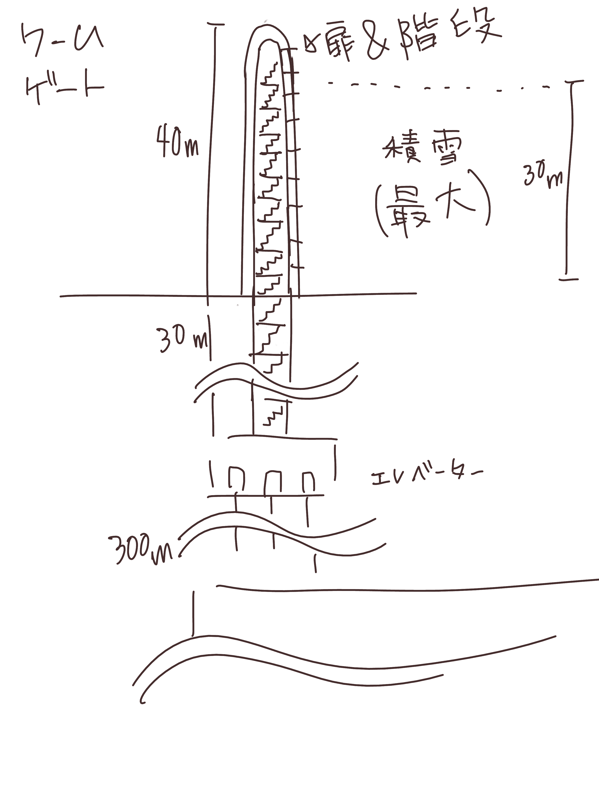

概要
===================

ベアン紀〜ルン紀は現在から約2億年後の地球が舞台。
2億年も経っているので、現在の地球とはいささか環境が違う。

* 1年は350日からなる。
* 1日は25時間からなる。

ルン紀は、ルニアでは普通サ・ファ・トトミ(聖暦)という。
サ・ファ・トトミでは、1年は14ヶ月からなり、
1ヶ月はきっかり25日である。

ルン紀における人口の推移

=====  ====================
Y        総人口
=====  ====================
1800    1億1300万人
1850    1億4000万人
1900    1億7000万人
2000    4億人
2100    7億人
=====  ====================

人種
==============

大まかに分けて、ルン紀にはベアン人とルン人の2種類の人種が存在する。
ベアン人とルン人は、遺伝子がかなり異なっていて、
たとえば、子供をつくることができない。
ルン人に分類される人種(純粋なルン人,クルト人,アクトン人)同士、
ベアン人に分類される人種(純粋なベアン人,アルシェニム,アクバロメイン)同士なら、
子供はつくれる。

ベアン人とルン人にも、それぞれ細かい人種があることに注意。

人種とは、生物分類的な意味での分け方であって、
文化国境による分類ではない。

なお、すくなくともルン紀の20世紀では、
海民と穴掘り民は人間ではないというのが一般的な見解であって、
人種には含まれない。もし海民を人間に含むとすれば、人種はもう
ひとつ増える。

ベアン人
----------

* ドルアイン(純粋なベアン人)
* アルシェニム
* アクバロメイン
* パストアウレイン

ルン人
----------

* ルン人(純粋なルン人)
* クルト人
* アクトン人
* ジトラル人
* ロド人

生物
===========

生物に分類される動物は、
文化的に人間ではないと認識される動物で、たとえば、通常、人権の対象にならない。
ルン紀の17世紀〜18世紀頃では、人間とはルン人のことであって、
ベアン人は生物であるとされていた。

海民
-------

* カサンドレイン
* ハルセイン

ルニアでは、
カサンドレインは、クルト・フィーファンと、
ハルセインは、ベアン・フィーフシスと
それぞれ呼ばれることもある。
これは、カサンドレインがほとんどクルティアの近辺に住んでいて、
ハルセインはほとんどベアンシスの近辺に住んでいるからである。

山賊小カラス
---------------

西暦3000〜4000年頃に地球に生息した、高度な知能を持つ
カラス。都市部の建物の窓を道具を使って割って侵入し、
食べ物を強盗などする。また、ときには人を殺すこともあり、
地球人からは非常に警戒されていた。

* **ハン** 山賊小カラスの少女。
  その名前ハンは、ベアン語の強さや恐ろしさを意味する「ハ」という
  単語の語源にもなっている。また、ベアンの女性名ハンナはハンが変化した名前。

ベアン人の遠い祖先でもある。

穴掘り民
----------

穴掘り民(あなほりたみ)は、鉱山の奥に住まう謎の生物のこと。
穴掘り民は、言葉を話し、また山の奥深くに穴を掘って
大きな文明を築いているといわれているが、その真相を知るものは
数少ない。穴掘り民の都を訪れて、生きて帰った者はいないからだ。
穴堀り民は、その気になればルニアを征服できるほどの
武力を備えているといわれているが、地上を侵略してくることはない。

ルーナ・ヴァライドリンは穴掘り民の文明を訪れて生きて帰った数少ない
ルン人の1人だ。

砂漠のワーム
------------------

:分布: アクトニア
:別名: ドラゴン

砂漠のワームは、俗にドラゴンともいわれる、砂漠に住まう巨大な
ミミズ。20mもの体長を持つ。幅は2mにも及ぶ。

砂漠狼
------------------

:分布: アクトニア
:別名: 虹色狼

砂漠狼は、砂漠に住む狼。体毛は色が薄く、透明で、光をよく反射する。
砂漠狼は、環境によって虹色に輝くので、虹色狼という別名を持つ。
砂漠狼は一度にたくさんの食べ物を蓄えることで、何週間も食べなくても
問題なく狩りを続けることができる。
砂漠狼は、たいへん凶暴で、ほとんど常に飢えているので、
旅人が出会ったらまず間違いなく教われる。

アクトニアでは、砂漠狼に襲われて死なないように、
砂漠狼の倒し方が教えられる。

ラマリオン
------------------

:分布: アクトニア

Ramarion 、アクトン語で「憎い生物」
ra は not 、 mar は 愛 、 ion は 〜の生物
屈強なアクトン人にとってワームのような力の強い敵なら容易に対処できたが、
ラマリオンのような毒には対処が難しかった

ラマリオンの毒はかなり強く、死ぬこともある
食事の頻度は多くなく、なんでも食べる。ごく少量の栄養でも砂の中から見つけ出して食べる。
また水分がほとんどなくても生きていけるので、砂漠全体にわたって栄えている。とはいえ水分は
あったほうがよく、よほどの水のない環境にいるラマリオンでなければ体内にたくわえている

多くのラマリオンは水分の多い土壌の近くの土に住んでいる。まったくなにもない完全な砂漠には
さすがにおらず、なにかしら栄養源になるものの近くに住んでいる。

ラマリオンは自主的に動物を殺す事はないが、食物を求め近寄ってきた動物に食べられそうになると
反撃して殺す事がある。そのあと、その遺体の腐敗した肉を食べて分解し、土壌を広くする

砂漠に住むほかのほとんどの生物の食料にもなる。ラマリオンは砂のなかに住んでおり、砂のなかで
栄養を吐き出す。そのため土壌を維持するのに貢献しており、砂漠の生態系を維持するのに
たいへん重要な役割をになっている

ベアン人はこの毒に対する免疫が強く、すぐに直ってしまう。その際、かなり免疫が働くので、一瞬だけ
視界がもうろうとして高熱や病気のような症状が起こる。ふつうのラマリオンの毒の量では数秒で解毒が
完了する。極端に量が多いとアナフィラキシー・ショックで死んでしまう事もある

場所
=======

セカンドアース
-------------

地球から6万光年離れた位置にある惑星。
地球に非常によく似た星であり、そのためセカンドアースと呼ばれている。
22世紀頃から見つかっていたが、遠過ぎて
到達不可能だった。長い間、セカンドアースに到達することが
人類の大きな目標となった。

イリス
-------------

地球から3200光年離れた位置にある惑星。
ライトノード。
23世紀くらいに見つかった。
地球人の技術水準でもじゅうぶんに到達できる
距離で、ハードノードやミドルノードに比べれば
人類が生存するにはとてもいい環境だったので、
とても期待された。ところが、放射線が強く
人類が生存できる程度であるかは、長い間
よくわかっていなかった。

レッドテテュス
-------------

地球から4.4万光年離れた位置にある惑星。
ミドルノード。
西暦22世紀に人類によって発見された。
その29億年後にはレッドテテュスの文明が栄えた。

レイターアース
-------------

レイターワールドに存在する地球によく似た惑星。
ライトノード。
地球から約3万光年離れている。レイターアースでは時間の進みが遅く、
レイターアースで1年経つ間に地球では10万年の時間が経つ。

TODO: いつ頃人類によって発見されたのか？
セカンドアースのほうがレイターアースより離れているが、
セカンドアースのほうがレイターアースより人類に愛されているのは
なぜか？

トライ
-------------

TODO

ベアンシス
------------

ベアンシスは、ベアン紀〜ルン紀にかけて
ルニアの西に存在する大陸。
ルン紀より1億年ほど前に火山活動により形成されたと考えられている。
考えられているという言い方をしているが、ようはまだあまりよく決まっていない
というわけである。山が多く、天候が崩れやすい。雨がよく降る。
雪はほとんど降らない [#a]_ 。気圧が低く、酸素は薄い。気温はとても低い。
聖ルニアより6度は低い。

雨がよく降るため、小麦の生産に適さない土地であり、反対に稲はよく育つ。
そのため、ベアンシスでは米食が普通。

気温はともかく、酸素が薄いため、ルン人にとっては苦しい環境。
ベアン人は気嚢を持つため、問題なく活動できる。
ルン人はベアンシスでは運動能力が低下したり、呼吸がはやくなり、体に力が入らず、
疲れやすくなったりする。場所によっては動けなくなったり意識を保っていられず失神する。
ベアン人はそのようなことはない。
だからベアン人ばかりが住んでいるわけだ。
長い歴史の中で、ルン人は幾度となくベアンシスを侵略しようとしたが、
この気候のおかげで進軍が阻まれベアン人の有利となっている。

.. [#a] どうして？ 山が多く、気温が低い、などの条件を考えれば雪は降りやすいはずでは？

歴史
=======

地球の歴史。

西暦
------------

ベアン紀〜ルン紀では、大文明紀と呼ばれる。

* 1世紀〜21世紀  -- われわれの知っている歴史
* 5001年 -- エルシー・アリス・レイク(ルーナ)が生まれた
* 54世紀 -- MYI がリリースされる

地球の人口は、2050年頃に90億人となり、2100年頃に140億人を超えた。
それから24世紀まで地球の人口は増加の一方を辿った。
人口は2150年頃に300億人を超え、2200年には500億人を超えた。
2300年では2000億人を超え、24世紀中頃の総人口は2650億人だった。
日本の人口は25億人に達した。日本のすべての都道府県は、2014年の東京都以上の人口密度
だった。

原始的な方法で子供をつくることは、むかしに比べて減っていた。
22世紀頃では、人間はつくれるものだったからだ。女性はわざわざ痛い思いをして
子供を産むことよりも、生産するほうを望んだ。もちろん、自然に生むことに幸せを
感じる人もいた。どちらにせよ、子供が欲しいという願望自体は変わらないらしく、
人間は爆発的に増えた。

22世紀頃から、子供をつくるという行為において、男女という性別を意識する必要がなくなった
ので、同性で結婚し子供を持つ家庭も増えた。父親が2人の子供や、母親が2人の子供は、
同性愛を不自然だとは思わなかったため、数世代もすると、同性愛がマジョリティではなくなった。
こうして同性愛が一般的になった。

21世紀から、 **RID** という技術があった。RID は遺伝子に符号化した情報を記録する
技術だった。それまで、情報の記録にはハードディスクなどを使っていたが、
RID によれば菌などにたくさんの情報を保存できる。とくに、生きた細胞に保存する技術は、
バイオストレージとも呼ばれた。 しかし、 RID の実用化は難しかった。生きた細胞に
情報を保存しても、細胞が死ぬとデータが失われてしまうし、細胞が分裂する際にデータが
損傷する可能性がある。そのため、 21世紀では生きていない細胞にデータを保存すること
しかできなかった。 22世紀には、生きた微生物を低温で保存し、それにデータを保存
することができた。そのあと、もっと大きな生物にもデータが保存できるのかもしれないと
考えられるのは必然だった。とくに、人間の遺伝子を書き換えて、情報を記録することは、
大きな目標となった。ほんのすこしでも遺伝子に情報を残すことができれば、遺伝子による
生体認証が容易になると考えられたからだ。ヒトの遺伝子の情報は極端に多いので、遺伝子
すべてを解析して個人を識別することは、可能だが、時間がかかりすぎる。そのため、
遺伝子による個人識別をするならば断片情報を利用することが現実的だったが、
遺伝子は人それぞれ違うため、すべての人に対して適用できる魔法の方程式は
存在しなかった。また、仮にできたとしても、たとえば、毛髪を盗むことで簡単に
騙せてしまうという致命的な問題もあった。 RID によれば、遺伝子に
もともとのヒトの遺伝子には存在しない任意の情報を埋め込むことで、その埋め込んだ情報だけを
たよりに個人を識別できるというわけだった。さらに、ハッシュ関数と同じで、
ほんのすこしでも情報を変えれば、パスワードを変えるみたいに過去の遺伝子による認証を
無効化できるので、セキュリティ的にもよかった。しかし、マウスによる実験によれば、
動物に対してRIDを適用には致命的な問題があった。遺伝子を傷つけることで、細胞が高確率でがん化
してしまうのだ。がん化を防ぎつつ、目標を達成するための知識を人類は持っていなかった。
こうして、 RID は人間で試されることはけしてなく、その後2800年間に渡って大容量記憶装置
としての技術として認識されていた。

これほどまでに人が増えると、大飢饉が起こると思われていたが、
脳死した家畜を大量生産することができたので、むしろ食料は余るほどだった。

食べ物の問題よりも、むしろ、土地の問題が深刻だった。
人類は、いまや、砂漠、山上、上空、地下、海上、海中、ありと
あらゆる場所に住居を構えていた。しかし、人類が増え続けることを阻止できない
以上、いつか地球に住む場所がなくなるは予測可能だった。

そのため、人類は新たな惑星を必要としていた。宇宙開発は、
ここ500年ほどの大きなテーマだった。しかし、太陽系以外の惑星に到達することは
依然難しかった。そもそも、人類が住める惑星がそんなに多くない上に、
あったとしても、到達までに1000年という単位で時間がかかってしまう。
そもそも到達できるかどうか怪しいうえに、そんなに長生きできる人はいないのだ。

人類の寿命を伸ばす試みは、21世紀から盛んに行なわれてきた。
**不老化** は、ヘイフリック限界を超えて、
細胞が死なないようにする技術だった。不老化は21世紀から研究が始まっていたが、
この頃は実験動物に適用されるに留まっていた。そのあと、研究者は人体にも適用しようと試みた
が、倫理的に厳しく批判されて、某国の強い要望で国際的に禁止されるに至った。
倫理的な理由以外にも、不老化は **人口爆発** を引き起こすと考えられ、
それによる大飢饉を懸念した決定でもあった。 22世紀では、この話題に言及するのはタブーとされていた。

ところが、23世紀頃、人口が増えすぎるにあたって、地球以外の居住区を見つけるのは
人類にとって必須の目標になった。そこで問題になったのは、地球以外の居住可能な
惑星に到達するには、時間がかかりすぎることだった。宇宙船を 世代宇宙船 とする方法も
考案された。ここにきて、不老化で寿命を伸ばせばいいよねということで、一縷の望みをかけて
研究が解禁されることとなった。それから、それが再び話題となって、実験が繰り返された。
当初、世間は不老化に猜疑的だったが、24世紀頃に、200歳近く生きた女性がいたため、
メディアによって広められ、有用性が認められるようになった。不老化が一般に浸透するのは、
24世紀のことだった。不老化を利用したビジネスは大反響した。

23世紀、不老化が広まり始めたとき、人口爆発を警告した人もいたが、
みんな自分には関係にないだろうと思って見向きもしなかった。

人が死ななくなると、人口が爆発されると思われていたが、
現実はそうではなかった。最初は人口は増える傾向にあったが、
どうにも新しく生まれた子供は、寿命がないため、世代交代という概念を
持たなかった。そのため、かれらは、子供をつくる意義を理解できなかった。
こうして子供をつくる意味がないという文化が広まると、人口はだんだんと
増えなくなり、25世紀には、3000億人くらいで安定した。

また、25世紀頃から子供を産んだり、つくったりすることが禁止された。
多くの有権者が子供をつくる意義を理解できなかったからだった。

西暦2500年頃から、地球に異変が起こり始めていた。
地球上の各地で大雪が降り始めたのだ。
地球は氷河期に突入していた。徐々に雪が溶けない地域が増え始めていた。
氷河期は、2000年〜3000年かけて北半球を氷漬けにするだろうと予測された。

その頃、地球には3000億人ほどの人が住んでいたが、地球の半分が雪になれば、
さすがに人は住めない。大勢の人が死んでしまう。あるいは、人類が滅んでしまうかもしれない。
そのため、強制移民で地球人の人口を減らすということになった。

いよいよもって地球上には人が多過ぎたため、人類は藁にもすがる思いで
宇宙船をとにかく飛ばしまくった。人が積み荷として運ばれた。

イリスは、大気が薄く、強い放射線が降り注ぐため、人類の生存には適さない
惑星であると思われていたが、それでもまだマシなライトノードだったため、
大量の人がイリスに強制移民させられた。イリスまで行くには、30年かかる。
イリスの環境に人類が適応できるかどうかは
未知数だった。9割近い人間が、イリスの環境に適応できずに死亡した。
少数の人がイリスに適応したが、そのほとんどは放射線の影響で肌が真っ赤に変わってしまった。
(イリス人の誕生である。)

イリスは地球と非常に近い場所にある惑星であり、地球からは 3200光年との距離にある。
西暦5000年の技術水準(光速の400倍の速度が出せる)なら 8年ほどで行けてしまう距離だ。
西暦2500年頃の技術水準(光速の100倍の速度だ出せる)なら 32年ほどかかる。

セカンドアースは、それまでに見つかっているなかで唯一地球とほぼ
同じ環境の惑星であり、地球人にとってもっとも過ごしやすいだろうと思われていた。
そのため、地球人はどうせ行くならセカンドアースに行きたいと誰もが
思っていた。もちろん、誰もがそう思うなら、金持ちが優先されることは
言うまでもない。セカンドアース行きの切符は、25世紀の地球で夢のようなもの
だった。しかし、セカンドアースはたいへん遠い場所にある惑星で、

セカンドアースは地球から 6万光年ほど離れた場所にあって、
西暦2500年頃の技術水準では、地球からだと600年以上の時間がかかる。
西暦5000年頃の技術水準では、地球からだと150年ほどかかる。

こうして周辺の惑星に人類は徐々に移住した。

超拡散時代の始まりだった。

西暦3000年頃の地球は、不思議な文化になっていた。
同性愛は当たり前で、かれらは同性と異性の違いを単なる肉体的特徴の差として
以上に捉えなかった。子供をつくるのに、男女でなければならないということもないし、
そもそも子供をつくる意義を知らないので、かれらは異性を特別に意識する必要がなかった。
こうして、ジェンダー・アップが起こった。

西暦5000年〜5100年頃の地球では、気温がとても低いので、
ほとんどの人は上下ともにタイツのような断熱材でできた服を着ている。
地球上のほとんどいたるところで常に雪が積もっているため、そもそも
人が外出することはほとんどなく(なにも考えずに外に出ると事故死する)、
また仮想現実などの技術で外部との交流もできるうえ、
仮想現実では好きな衣装を着ることができるので、
現実世界におけるファッションの重要性がないからである。

MYI はこの時代の女性をイメージしてデザインされたため、
あのような服装をしている。

西暦 5100年〜5200頃のセカンドアースでは、
人々は多種多様な服を着ている。セカンドアースは地球とは対極のように
よい環境であり、働いたり勉強したりする必要もないため、逆に、
ファッションくらいしかすることがないのである。
かれらはありとあらゆる時代、文化の衣装を参考にして、
それを復元したり組み合わせたりして、他人との差別化をはかっている。
そのため、まるでコスプレイベントのように奇抜な格好をした人が
多くいる。

西暦 5000年頃の地球は、地球上のほとんどの地域で雪が積もっていた。
北半球はほぼ氷で覆われ、海も凍結している。南半球では海は液体であり、
大陸には1年を通じて雪が積もっている。北半球は、年間の平均気温は -5度くらいで、
最低気温は -45度にもなる。南半球は、平均気温は夏期で 10度前後であり、
冬期で -10度前後になる。
北半球ではほとんど温度が上昇せず、雪は積もると積もりっぱなしで溶けないので、
毎年氷床が巨大化している。
南半球では、冬期にはほとんどの地域で9階建てのビルくらいの厚さの
雪が積もり、夏期にはゆっくりと溶ける。10月頃から4月頃まで、半年近くも
雪が降り続ける。5月頃から雪は溶け始めるが、完全に溶ける前に次の雪が降り始めるため、
およそ1年を通じて雪が積もっている。

西暦 5000年頃では、北半球では生活できないので、人類は
南半球に住んでいる。南半球でも、雪がたくさん積もるので、およそ
現在と同じような生活は認められない。住居は雪の重さで潰れてしまうので、
地球人はみんな地下に住んでいる。

地下 3000m 〜 4000m には、直径 500m 、高さ 1000m くらいの円筒状の空間が
たくさんつくられており、発電や廃棄物処理、食料生産などに利用されている。
この空間は、人間の生活圏として利用されることはない。地熱によって温度が
90度 〜 120 度にもなるためだ。その空間は、地下ならどんな場所にでも作れるというわけ
ではなく、巨大な地圧に耐えられるだけの厚く固い岩盤が必要であって、柔らかい
土の場所にはつくられていない。

人間の生活圏である空間は 地下 300m 程度に掘られている。
この程度の深さであらば、地圧が比較的低いため、空間自体が潰れる心配はないとされている。
(積雪などの影響で地圧が高くなるとたびたび空間が潰れる事故が起こっている)。
気温は地上より 9度 〜 10度 ほど高く、夏期は 20度、冬期は 5度くらいになる。
地下なので、雨や雪などに晒されることはない。
広い空間をつくると、地圧によって崩れてしまうため、つくられる空間は
ほとんど 直径 10m で高さ 20m くらいの大きさで、円筒状であり、
ひとつの家族が住むのがちょうどいいくらいの空間になってる。
直径 5000m 高さ 1000m くらいの、都市のように巨大な空間もあるけども、
それはよっぽど運よく崩れにくい岩盤があったからで、地球全体で見ると
少ない。

直径 5000m 高さ 1000m くらいの空間を都市といって、
経済の中心になっている。都市部に
地下で生活する人で、このように大きな都市部に暮らす人と、
直径 10m で高さ 20m の穴に住む人がいる。後者のほうが
ずっと多い。都市部に暮らすほうがなにかと便利だけど、
金がかかる。

直径 10m で高さ 20m の穴に住む家では、
食料や電気がそれぞれの家で蓄えられており、
少なくなれば都市部に買い出しにいく。
買い出しに行く際は、雪が積もった地上を通る。

都市と家を繋ぐ道は潰れてしまうのでつくられない。

北半球の地下も生活圏として利用されたこともあったが、空間が雪の重みで潰れて
しまったため、 5000年では利用されていない。

地表が雪に覆われて真っ白に見えるので、
地球はホワイトアースと呼ばれる。

地下に入るために、地上にはワームゲートと呼ばれる
建物がある。ワームゲートは、積雪に耐えられるように頑丈につくられている、
高さ 40m くらいの建造物で、各階には外部との連絡をとる扉がついており、
内部はほとんど階段のみで構成されている。ワームゲートからさらに
地下 30m くらいの位置にエレベーターへの連絡通路があり、このエレベーターで
300m ほど地下に潜る。どうしてワームゲートにはエレベーターではなく
階段があるのかというと、エレベーターは積雪で壊れてしまうからだ。

22世紀頃から、 **レッドテテュス** の存在は知られていた。
レッドテテュスは地球から 4.4万光年ほど離れた位置にあるミドルノードだ。
レッドテテュスは表面をほぼ赤い海で覆われており、大陸は存在せず、
赤く見える。赤く見える理由は鉄が錆びたもの(水酸化鉄)だ。海中に酸素が
多く含まれているため鉄イオンが酸化してこうした海が生じている。
海中には主に嫌気性生物とシアノバクテリアによく似た光合成をする生物が
大繁殖している。大気中の酸素は非常に薄く、二酸化炭素が濃い。
温室効果のために、だんだん気温が上昇している。

レッドテテュスには海や地球外生命が存在することから、よく研究されて
理解が進んでいた。レッドテテュスの未来は2通り予測されていた。
大陸が出現し、二酸化炭素が大陸に固定化されて大気中の
二酸化炭素が減ることで、寒冷化する未来と、大陸が出現せず、
温室効果で気温が上昇し続け、海が干上がる未来だ。
後者では、生命が絶滅するだろうと考えられていた。
前者の場合、生命は進化を続け、25億年以内に地球に生まれたような
複雑な生命が誕生するだろうと考えられていた。

レッドテテュスの大気は酸素濃度が低いため、人類が住むには
適さない惑星だった。また、地球外生命が存在する貴重な
サンプルなので、保護されており、勝手に入ったり住んだりすることは
禁止されていた。

レッドテテュスはミドルノードなので、生命が存在することはできる。
そのため、光合成をおこなう細菌や植物を繁殖させ、テラフォーミング
をおこなうことは可能だと考えられていた。

超拡散時代
------------

セカンドアース、イリス、トライ。

用語。

* セカンドホームワールド -- 地球が滅びたあと、地球人の第二の故郷となった星々のこと。
  セカンドアースは代表的なセカンドホームワールドである。
* アンクノード -- 地球人が住んでいるが、もはや競争に追いつけなくなった惑星のこと。
  トライは代表的なアンクノードである。
* ライトノード -- 環境がよくて、人が住める惑星のこと。
* ミドルノード -- 環境がよくて、生命が存在することができるが、人は住めない惑星のこと。
  テラフォーミングできる可能性がある。
* ハードノード -- 環境が悪くて、生命が存在できない惑星のこと。ほとんどすべての惑星は
  ハードノードに分類される。テラフォーミングは不可能。

* レイターワールド -- 銀河系の中心に近い空間のこと。
  レイターワールドはセカンドホームワールドや地球の近くの空間に比べて時間の進みが
  遅いことがわかっており、そのためレイター(later)と呼ばれる。
  もっとも銀河系の中心に近い場所では、レイターワールドで1年経つ間に
  地球では10万年もの時間が経つ。

* レイターアース -- レイターワールドでもっとも地球によく似た惑星。

ベアン紀
------------

ベアン紀は、地球にベアン人が自然発生したことから始まった。
ベアン人は徐々に文明開化した。

ベアンの文明で著しく発展した学問は考古学だった。
ベアンは、すこしずつ、「どうやら、この地球には、2億年ほど前にかつてないほど巨大な文明があったらしい」
ということを知りはじめたのだ。ベアン人がMYIと遭遇し、その事実が周知されるようになると、
投資家の注目を集め、研究が活発になった。2億年前に存在したはずの文明は、(もちろん、それは西暦のことでは
あるが、)大文明と呼ばれるようになった。

ベアン紀に、エルシーがレイターアースから地球に観光にやってきた。
ベアン人は、こうして生きた大文明人であるルーナを手に入れることに成功した。
ルーナは、話し手であったので、ベアン人の誰よりも強い力を持っていた。
しかし、ベアンの文明の平和を願うMYIに警告されたので、ルーナは魔法を使うことができなかった。
魔法を使えないのでは、ルーナはただのか弱い女の子だった。
そのため、ルーナはベアン人に従わざるをえなかった。
ベアン人は、ルーナを乱暴に扱った。
ベアン人は、ルーナの遺伝子から大文明人を現代に復活させることに成功した。
大文明人は、徐々に数を増やした。
こうして、ベアン人と大文明人が同時に存在する時代が訪れた。
大文明人は、主に、研究対象や、家畜として扱われるようになった。

ドリンは、純粋なベアン人を改良してポストベアン人をつくりだした。
ポストベアン人は、ドルアインと呼ばれた。

大文明の研究が進むにつれ、ベアンの文化は北と南で分離するようになった。
北の文化は、アルト派と呼ばれた。アルト派では、大文明の研究が盛んに
行なわれた。アルト派は、かつて存在したはずの大文明の文化、資産、そして技術を
吸収し、迅速に発展した。
南はベアン派と呼ばれ、大文明の研究が推奨されなかった。北に比べ、
研究が活発でなかった。ベアン派の文化は、ベアン人らしい発展を遂げた。

アルト派とベアン派は、もはや同じベアン人とは思えないほど違う文化を持っていた。
アルト派は、大文明の文化を徹底的に研究した。英語を公用語とするようになるほど
であった。

MYIは、アルト派の文明の発展を手助けした。

アルト派とベアン派で戦争が起きた。最終的に、アルト派が勝利し、この戦争は終わった。

それからアルト派が徐々にベアン派を支配するようになり、
ベアン派は滅びた。

アルト派の研究はついにMYIにまで及んだ。
MYIは、アルト派に対して、危機意識を感じた。
ついに、MYIは、アルト派に助力をしないようになった。

アルト派はMYIを攻撃し、力づくで支配しようとした。
MYIはベアン人がまだ太陽系を離れることすらできないか弱い原始的な
生物だと知っていたので、ベアン人に対して再三の警告をした。
しかし、アルト派は自分たちとMYIの力量の差を正しく計ることができなかった。
MYIは、仕方がないので、すべてを押し流す大洪水を起こして、
かれらに事情を理解させた。

そのあと、アルシェナリムによって、ファストティアサリ(Fastothiasarry)がつくられた。
はじめてのベアン人(ドルアイン)と大文明の混血であった。
ファストティアサリの子孫は、アルシェニムと呼ばれるようになった。

カサルフェナリムによって、ハリスがつくられた。
最初の海民であった。ハリスは女性形としてつくられた。
ハリスは黒い羽毛を持っていた。カサルフェナリムは、ハリスを
複製して多数の海民をつくった。しかし、かれらはいまいち知性にかけていて、
攻撃的だった。カサルフェナリムはハリスとその複製を失敗作だということにして、
カサンドラをつくった。カサンドラは女性形としてつくられ、白い
羽毛を持っていた。カサンドラは聡明な女性に成長した。
カサルフェナリムの死後、カサルドナリムがカサンドラを所有したが、
カサルドナリムは彼女が可哀想だったのでクルティアの海に逃がした。
こうして、カサンドラの子孫はカサンドレインと呼ばれるようになった。
ハリスの子孫はハリセインと呼ばれた。
カサンドレインは白い羽毛を持つ海民で、ハリセインは黒い羽毛を持つ
海民であった。

ベアン人(ドルアイン)のファジェシバリスと、アクトン人のアクルドゥナは、恋仲だった。
しかし、ベアン人とアクトン人の間に子供はできない。それをファジェシバリスが
残念に思っているところへ、エオラインが現れて、ファジェシバリスの肉体を改造し、
子供ができるようにした。ファジェシバリスは悦び、アクルドゥナとの間に子をもうけた。
子はアクバロマと名付けられ、かれの子孫は、アクバロメインと呼ばれるようになった。

ルン紀
------------

ベアン人(アルシェニム)のパスベルスは、ロドの女性ネワイェウィンにそそのかされて、
ドゥディオヴァドリでパストアウルをつくった。その際、パスベルスがMYIに子とその子孫
の長寿を約束してほしいと願うと、MYIは快く了承し、パストアウルと、その子孫すべての
長寿を約束した。パストアウルは、特別な娘で、ベアン人であるにも関わらず、
120年も生きた。そして、パストアウルの娘のパセレナも、やはり同じように長寿であった。
こうして、パストアウルの子孫は、パストアウレインと呼ばれるようになった。

その後
------------------

ルン紀からあとの時代について。
ルン紀から約 27億年後、レッドテテュスに レッドテテュスの文明が生まれる。
レッドテテュスの文明は 4万年も続く。

その頃のレッドテテュスは、海は真っ青で植物が生い茂り、
恐竜が地上を支配する時代だった。
レッドテテュス人は恐竜の血族なので、ベアン人とよく似た特徴を持っていた。

レッドテテュス人はセカンドアースや
イリス、トライ、ホワイトアースなどを発見し、人類とベアン人の存在を突き止める。

その際、ベアン人とレッドテテュス人の身体特徴が似ていることで、
ベアン人はレッドテテュス人の祖先ではないかと考える。

レッドテテュス人は英語を解読し、セカンドアースではレッドテテュス人の住む
惑星がレッドテテュスと呼ばれていたことを突き止める。そして、偉大な先人に敬意を
払い、その惑星をブルーテテュスと改名する。レッドテテュスではなくブルーテテュスなのは、
もはや海が赤くないからだ。

レッドテテュス人は 5億年前(ルン紀から22億年後)の生命の爆発(カンブリア爆発みたいな
現象)はベアン人によるインテリジェント・デザインであると考えるが、
ベアンの文明が22億年も続いている証拠はなかった。

参考文献
=============

* `惑星クラス分類 <http://ja.memory-alpha.org/wiki/%E6%83%91%E6%98%9F%E3%82%AF%E3%83%A9%E3%82%B9%E5%88%86%E9%A1%9E>`_
* `Yクラス <http://ja.memory-alpha.org/wiki/Y%E3%82%AF%E3%83%A9%E3%82%B9>`_
* `ソリア <http://ja.memory-alpha.org/wiki/%E3%82%BD%E3%83%AA%E3%82%A2>`_
* `ソリアン <http://ja.memory-alpha.org/wiki/%E3%82%BD%E3%83%AA%E3%82%A2%E3%83%B3>`_
* `ヒューマノイド <http://ja.memory-alpha.org/wiki/%E3%83%92%E3%83%A5%E3%83%BC%E3%83%9E%E3%83%8E%E3%82%A4%E3%83%89>`_

* `技術的特異点 <http://ja.wikipedia.org/wiki/%E6%8A%80%E8%A1%93%E7%9A%84%E7%89%B9%E7%95%B0%E7%82%B9>`_
* `ポストヒューマン (人類進化) <http://ja.wikipedia.org/wiki/%E3%83%9D%E3%82%B9%E3%83%88%E3%83%92%E3%83%A5%E3%83%BC%E3%83%9E%E3%83%B3_%28%E4%BA%BA%E9%A1%9E%E9%80%B2%E5%8C%96%29>`_
* `強いAIと弱いAI <http://ja.wikipedia.org/wiki/%E5%BC%B7%E3%81%84AI%E3%81%A8%E5%BC%B1%E3%81%84AI>`_

* `地球は氷河期に突入した <http://www.skepticalscience.com/translation.php?a=53&l=11>`_
* `2014年にプチ氷河期がやってくる？！ <http://www.excite.co.jp/News/column_g/20130221/Sugomori_12565.html>`_
* `太陽系と地球の誕生 <http://www.geocities.jp/msakurakoji/900Note/103.htm>`_
* `地球寒冷化 <http://ja.wikipedia.org/wiki/%E5%9C%B0%E7%90%83%E5%AF%92%E5%86%B7%E5%8C%96>`_
* `熱塩循環 <http://ja.wikipedia.org/wiki/%E7%86%B1%E5%A1%A9%E5%BE%AA%E7%92%B0>`_
* `藍藻 <http://ja.wikipedia.org/wiki/%E8%97%8D%E8%97%BB>`_
* `三葉虫 <http://ja.wikipedia.org/wiki/%E4%B8%89%E8%91%89%E8%99%AB>`_
* `カンブリア爆発 <http://ja.wikipedia.org/wiki/%E3%82%AB%E3%83%B3%E3%83%96%E3%83%AA%E3%82%A2%E7%88%86%E7%99%BA>`_

* `人間の寿命は今後20年で1000歳以上に <http://x51.org/x/04/12/1018.php>`_
* `SENS Research Foundation <http://en.wikipedia.org/wiki/SENS_Research_Foundation>`_
* `ヘイフリック限界 <http://ja.wikipedia.org/wiki/%E3%83%98%E3%82%A4%E3%83%95%E3%83%AA%E3%83%83%E3%82%AF%E9%99%90%E7%95%8C>`_
* `生物学における不老不死 <http://ja.wikipedia.org/wiki/%E7%94%9F%E7%89%A9%E5%AD%A6%E3%81%AB%E3%81%8A%E3%81%91%E3%82%8B%E4%B8%8D%E8%80%81%E4%B8%8D%E6%AD%BB>`_
* `ベニクラゲ <http://ja.wikipedia.org/wiki/%E3%83%99%E3%83%8B%E3%82%AF%E3%83%A9%E3%82%B2>`_
* `人間の寿命を１０００歳まで延ばす技術を開発している男 <http://pokapoka9.exblog.jp/15249839>`_
* `抗老化医学 <http://ja.wikipedia.org/wiki/%E6%8A%97%E8%80%81%E5%8C%96%E5%8C%BB%E5%AD%A6>`_
* `縄文人は短命だった？ <http://www.ies.or.jp/publicity_j/mini_hyakka/30/mini30.html>`_
* `世代宇宙船 <http://ja.wikipedia.org/wiki/%E4%B8%96%E4%BB%A3%E5%AE%87%E5%AE%99%E8%88%B9>`_

* `DNAを使って、大容量のハードディスクができる？ <http://www.tel.co.jp/museum/magazine/news/042.html>`_
* `大腸菌にデータを保存、香港中文大のバイオストレージ研究 <http://www.afpbb.com/articles/-/2782041?pid=6645693>`_
* `高齢化とともに増えるがん／きっかけは遺伝子の傷 <http://www.nissui.co.jp/academy/eating/08/>`_
* `細胞ががん化する仕組み <http://ganjoho.jp/public/dia_tre/knowledge/cancerous_change.html>`_
* `虹彩認識 <http://ja.wikipedia.org/wiki/%E8%99%B9%E5%BD%A9%E8%AA%8D%E8%AD%98>`_
* `生体認証 <http://ja.wikipedia.org/wiki/%E7%94%9F%E4%BD%93%E8%AA%8D%E8%A8%BC>`_
* `ＤＮＡ解析の基礎知識 <http://www4.plala.or.jp/kirakira/gakusyu/dna/dna.htm>`_
* `DNA型鑑定 <http://ja.wikipedia.org/wiki/DNA%E5%9E%8B%E9%91%91%E5%AE%9A>`_
* `夢の巨大地下空間をつくる <http://www.kajima.co.jp/news/digest/jan_2001/tokushu/toku01.htm>`_
* `生命の誕生と40億年の進化 <http://www.geocities.jp/msakurakoji/900Note/105.htm>`_

* `チューブワーム <http://ja.wikipedia.org/wiki/%E3%83%81%E3%83%A5%E3%83%BC%E3%83%96%E3%83%AF%E3%83%BC%E3%83%A0>`_
* `熱水噴出孔 <http://ja.wikipedia.org/wiki/%E7%86%B1%E6%B0%B4%E5%99%B4%E5%87%BA%E5%AD%94>`_
* `溶解 <http://ja.wikipedia.org/wiki/%E6%BA%B6%E8%A7%A3>`_
* `エウロパ (衛星) <http://ja.wikipedia.org/wiki/%E3%82%A8%E3%82%A6%E3%83%AD%E3%83%91_%28%E8%A1%9B%E6%98%9F%29>`_
* `知の最先端 - Webマガジンen <http://www.shiojigyo.com/en/backnumber/0303/main.cfm>`_
* `炭素循環 <http://ja.wikipedia.org/wiki/%E7%82%AD%E7%B4%A0%E5%BE%AA%E7%92%B0>`_
* `惑星としての地球  <http://www.ep.sci.hokudai.ac.jp/~keikei/enlighten/earth.html>`_
* `生命の起源 <http://ja.wikipedia.org/wiki/%E7%94%9F%E5%91%BD%E3%81%AE%E8%B5%B7%E6%BA%90>`_
* `共通祖先 <http://ja.wikipedia.org/wiki/%E5%85%B1%E9%80%9A%E7%A5%96%E5%85%88>`_
* `生命誕生 <http://www1.fctv.ne.jp/~ken-yao/Earth.htm>`_
* `換羽 <http://akaitori3.web.fc2.com/kanu.html>`_
* `アポトーシス <http://ja.wikipedia.org/wiki/%E3%82%A2%E3%83%9D%E3%83%88%E3%83%BC%E3%82%B7%E3%82%B9>`_
* `エピジェネティクス <http://ja.wikipedia.org/wiki/%E3%82%A8%E3%83%94%E3%82%B8%E3%82%A7%E3%83%8D%E3%83%86%E3%82%A3%E3%82%AF%E3%82%B9>`_
* `最も近い・遠い天体の一覧 <http://ja.wikipedia.org/wiki/%E6%9C%80%E3%82%82%E8%BF%91%E3%81%84%E3%83%BB%E9%81%A0%E3%81%84%E5%A4%A9%E4%BD%93%E3%81%AE%E4%B8%80%E8%A6%A7>`_

* `山の天気　（山と渓谷社より抜粋） <http://www005.upp.so-net.ne.jp/abeeiji/abe179.htm>`_
* `ワープ・ドライブ <http://ja.memory-alpha.org/wiki/%E3%83%AF%E3%83%BC%E3%83%97%E3%83%BB%E3%83%89%E3%83%A9%E3%82%A4%E3%83%96>`_